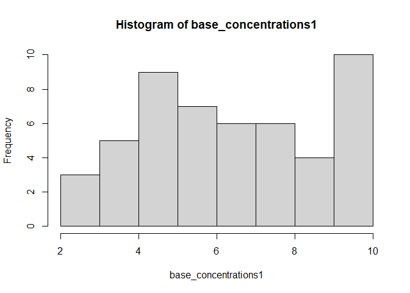
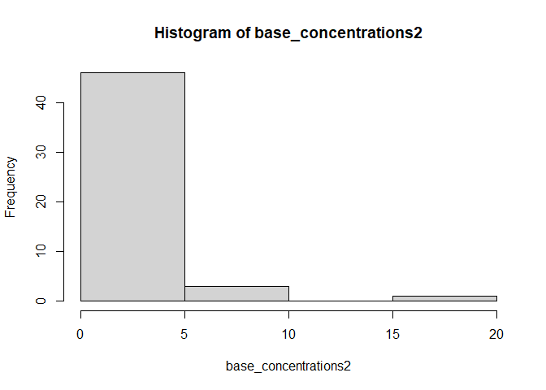
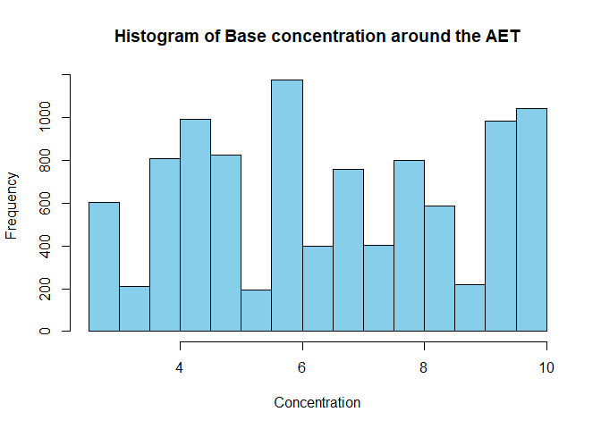
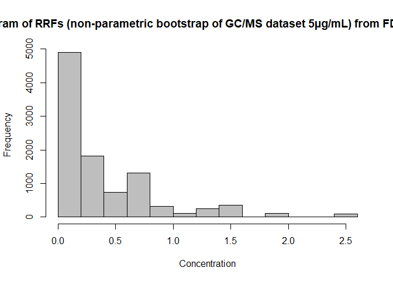
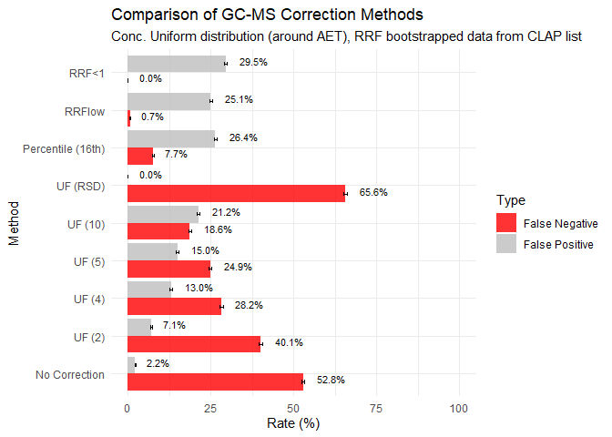
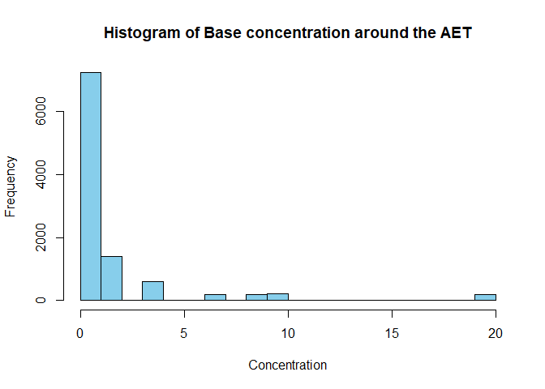
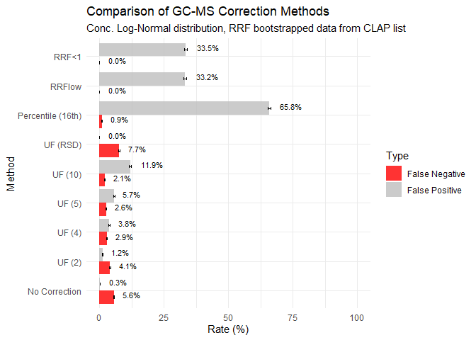
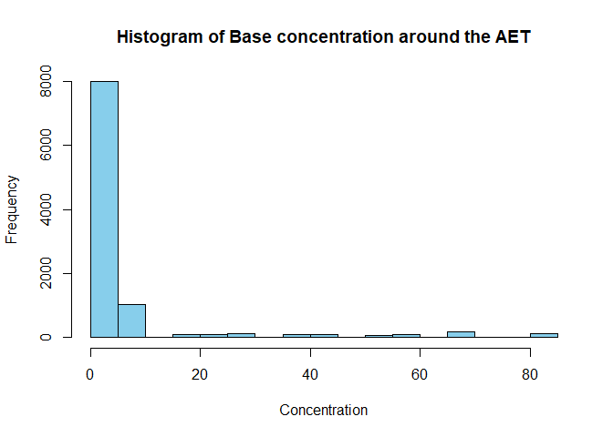
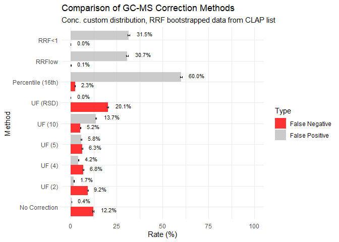

el_bias
================
Sophie Yam
2025-12-16

# Libraries

``` r
#install.packages("tabulapdf")

# Load required packages
library(tidyverse)
library(dplyr)
library(purrr)
library(lubridate)
library(ggplot2)
library(here)
library(parallel)
library(pdftools)
library(stringr)
library(rJava)
library(tabulapdf) # for data tables extraction
library(readxl)
```

# Data Extraction

Data for RRFs are coming from the US FDA Clap List.
<https://cdrh-rst.fda.gov/chemicals-list-analytical-performance-clap>

Each file is in a pdf format and contains RRF values for 3 concentration
of a surrogate. LCMS RRFs CLAP Negative Ion Detection.pdf (255.54 KB)
LCMS RRFs CLAP Positive Ion Detection.pdf (279.48 KB) RRF GCMS for
CLAP.pdf (322.77 KB)

They are first extracted to perform the bootstrap simulation. Some data
are n.d. or below DL. The current strategy is to change the n.d. to 0
and below DL to 0.001 based on the input of the Subject Matter Expert.

# Extract GC/MS data

Tried to extract the data directly from the pdf but it was complicated.
I manually performed the extraction in Excel using PowerQuery.

``` r
gc_ms <- extract_tables("dataset/GCMS.pdf", method="stream")
gc_ms
```

    ## [[1]]
    ## # A tibble: 17 × 5
    ##    ...1  ...2                             ...3       ...4  `RRF from GCMS (TIC)`
    ##    <chr> <chr>                            <chr>      <chr> <chr>                
    ##  1 Code  <NA>                             Trivial N… CAS # (Positive Ion Detect…
    ##  2 <NA>  <NA>                             <NA>       <NA>  5 μg/mL 10 μg/mL 20 …
    ##  3 RM1   Irganox 1010                     <NA>       6683… n.d. n.d. n.d.       
    ##  4 RM2   Irganox 1076                     <NA>       2082… 0.326 0.434 0.336    
    ##  5 RM3   Irgafos 168                      <NA>       3157… 0.414 0.393 0.281    
    ##  6 RM4   2,6-Di-t-butyl-4- methylphenol   <NA>       128-… 1.828 2.143 1.810    
    ##  7 RM5   2,4-Di-t-butyl phenol            <NA>       96-7… 1.000 1.000 1.000    
    ##  8 RM6   2,4-Dimethylphenol               <NA>       105-… 0.710 0.377 0.424    
    ##  9 RM7   3-tert-Butyl-4-hydroxyanisole    <NA>       2501… 0.606 0.506 0.583    
    ## 10 RM8   Di-(2-ethylhexyl)phthalate       <NA>       117-… 0.823 0.824 0.838    
    ## 11 RM9   Dibutylphthalate                 <NA>       84-7… 0.713 0.744 0.822    
    ## 12 RM10  Diphenyl phthalate               <NA>       84-6… 0.180 0.437 0.676    
    ## 13 RM11  Benzyl butyl phthalate           <NA>       85-6… 0.364 0.383 0.476    
    ## 14 RM12  Tris (2-ethylhexyl) trimellitate <NA>       3319… 0.503 0.470 0.525    
    ## 15 RM13  Caprolactam                      <NA>       105-… 0.214 0.289 0.413    
    ## 16 RM14  Bisphenol A                      <NA>       80-0… 0.066 0.241 0.314    
    ## 17 RM15  Erucamide                        <NA>       112-… 0.143 0.165 0.086    
    ## 
    ## [[2]]
    ## # A tibble: 26 × 5
    ##    ...1  ...2               ...3         ...4       `RRF from GCMS (TIC)`       
    ##    <chr> <chr>              <chr>        <chr>      <chr>                       
    ##  1 Code  <NA>               Trivial Name CAS #      (Positive Ion Detection Mod…
    ##  2 <NA>  <NA>               <NA>         <NA>       5 μg/mL 10 μg/mL 20 μg/mL   
    ##  3 RM16  Oleamide           <NA>         301-02-0   0.033 0.035 0.040           
    ##  4 RM17  Butyl stearate     <NA>         123-95-5   0.295 0.288 0.275           
    ##  5 RM18  Tinuvin 320        <NA>         3846-71-7  0.182 0.575 0.723           
    ##  6 RM19  D4 siloxane        <NA>         556-67-2   1.262 1.828 1.537           
    ##  7 RM20  D6 Siloxane        <NA>         540-97-6   1.076 0.773 1.134           
    ##  8 RM21  Diisobutyl adipate <NA>         141-04-8   0.663 0.609 0.625           
    ##  9 RM22  Diisooctyl azelate <NA>         26544-17-2 n.d. n.d. n.d.              
    ## 10 RM23  Dibutyl sebacate   <NA>         109-43-3   0.377 0.393 0.451           
    ## # ℹ 16 more rows
    ## 
    ## [[3]]
    ## # A tibble: 26 × 4
    ##    ...1  ...2                    ...3     `RRF from GCMS (TIC)`        
    ##    <chr> <chr>                   <chr>    <chr>                        
    ##  1 Code  Trivial Name            CAS #    (Positive Ion Detection Mode)
    ##  2 <NA>  <NA>                    <NA>     5 μg/mL 10 μg/mL 20 μg/mL    
    ##  3 RM47  Lauramide DEA           120-40-1 n.d. n.d. n.d.               
    ##  4 RM48  Monostearin             123-94-4 n.d. n.d. n.d.               
    ##  5 RM49  Benzothiazole           95-16-9  0.863 0.891 0.857            
    ##  6 RM50  BDMA                    103-83-3 1.530 1.467 1.358            
    ##  7 RM51  4-tert-Butylphenol      98-54-4  0.687 0.724 0.737            
    ##  8 RM52  4-tert-Amylphenol       80-46-6  0.615 0.527 0.606            
    ##  9 RM53  4,4'-Methylenedianiline 101-77-9 0.142 0.243 0.377            
    ## 10 RM55  CBS                     95-33-0  0.104 0.107 0.149            
    ## # ℹ 16 more rows
    ## 
    ## [[4]]
    ## # A tibble: 27 × 5
    ##    ...1  ...2                                ...3    ...4  `RRF from GCMS (TIC)`
    ##    <chr> <chr>                               <chr>   <chr> <chr>                
    ##  1 Code  <NA>                                Trivia… CAS # (Positive Ion Detect…
    ##  2 <NA>  <NA>                                <NA>    <NA>  5 μg/mL 10 μg/mL 20 …
    ##  3 RM73  DOTP                                <NA>    6422… 0.266 0.292 0.265    
    ##  4 RM74  Acetyltributyl citrate              <NA>    77-9… 0.333 0.356 0.347    
    ##  5 RM75  Dioctyl azelate                     <NA>    2064… 0.042 0.038 0.037    
    ##  6 RM76  Bis(2-ethylhexyl)sebacate           <NA>    122-… 0.175 0.286 0.238    
    ##  7 RM77  Diisononyl phthalate                <NA>    2855… below DL below DL be…
    ##  8 RM79  Diisodecyl adipate                  <NA>    2717… n.d. n.d. n.d.       
    ##  9 RM80  Dicyclohexyl phthalate              <NA>    84-6… 0.510 0.527 0.443    
    ## 10 RM83  di(2-ethylhexyl) hexahydrophthalate <NA>    84-7… 0.277 0.294 0.274    
    ## # ℹ 17 more rows
    ## 
    ## [[5]]
    ## # A tibble: 6 × 4
    ##   ...1  ...2                      ...3     `RRF from GCMS (TIC)`        
    ##   <chr> <chr>                     <chr>    <chr>                        
    ## 1 Code  Trivial Name              CAS #    (Positive Ion Detection Mode)
    ## 2 <NA>  <NA>                      <NA>     5 μg/mL 10 μg/mL 20 μg/mL    
    ## 3 RM102 2-Phenyl-2-propanol       617-94-7 0.728 0.737 0.691            
    ## 4 RM103 1-Dodecene                112-41-4 1.444 1.765 1.645            
    ## 5 RM105 Dilauryl thiodipropionate 123-28-4 n.d. n.d. n.d.               
    ## 6 RM106 Ethyl carbitol            111-90-0 below DL 0.028 0.088         
    ## 
    ## [[6]]
    ## # A tibble: 1 × 4
    ##   Min   `0.014` `0.022...3` `0.022...4`
    ##   <chr>   <dbl>       <dbl>       <dbl>
    ## 1 Max      2.55        2.14        1.81

# GC/MS data

``` r
gcms_clap <- read_excel( 
  path = "processed_data/GCMS.xlsx", 
  sheet = "GC-MS")

gcms_clap_clean <- gcms_clap %>%
  na.omit()

gcms_clap_clean
```

    ## # A tibble: 92 × 6
    ##    Code  `Trivial Name`                 `CAS #`  `5 µg/mL` `10 µg/mL` `20 µg/mL`
    ##    <chr> <chr>                          <chr>        <dbl>      <dbl>      <dbl>
    ##  1 RM1   Irganox 1010                   6683-19…     0          0          0    
    ##  2 RM2   Irganox 1076                   2082-79…     0.326      0.434      0.336
    ##  3 RM3   Irgafos 168                    31570-0…     0.414      0.393      0.281
    ##  4 RM4   2,6-Di-t-butyl-4- methylphenol 128-37-0     1.83       2.14       1.81 
    ##  5 RM5   2,4-Di-t-butyl phenol          96-76-4      1          1          1    
    ##  6 RM6   2,4-Dimethylphenol             105-67-9     0.71       0.377      0.424
    ##  7 RM7   3-tert-Butyl-4-hydroxyanisole  25013-1…     0.606      0.506      0.583
    ##  8 RM8   Di-(2-ethylhexyl)phthalate     117-81-7     0.823      0.824      0.838
    ##  9 RM9   Dibutylphthalate               84-74-2      0.713      0.744      0.822
    ## 10 RM10  Diphenyl phthalate             84-62-8      0.18       0.437      0.676
    ## # ℹ 82 more rows

``` r
gcms_clap_clean$"5 µg/mL" <- as.numeric(gcms_clap_clean$"5 µg/mL")
gcms_clap_clean$"10 µg/mL" <- as.numeric(gcms_clap_clean$"10 µg/mL")
gcms_clap_clean$"20 µg/mL" <- as.numeric(gcms_clap_clean$"20 µg/mL")

hist(gcms_clap_clean$"5 µg/mL", 
     main = "Histogram of RRFs for GC/MS with a 5 µg/mL surrogate Concentration", 
     xlab = "RRF",
     col = "skyblue")
```

<!-- -->

``` r
hist(gcms_clap_clean$"10 µg/mL", 
     main = "Histogram of RRFs for GC/MS with a 10 µg/mL surrogate Concentration", 
     xlab = "RRF",
     col = "orange")
```

<!-- -->

``` r
hist(gcms_clap_clean$"20 µg/mL", 
     main = "Histogram of RRFs for GC/MS with a 20 µg/mL surrogate Concentration", 
     xlab = "RRF",
     col = "red")
```

<!-- -->

# LC/MS pos data

``` r
lcmspos_clap <- read_excel( 
  path = "processed_data/LCMS.xlsx", 
  sheet = "LCMSPOS")

lcmspos_clap_clean <- lcmspos_clap %>%
  na.omit()


hist(lcmspos_clap_clean$"5 µg/mL", 
     main = "Histogram of RRFs for GC/MS with a 5 µg/mL surrogate Concentration", 
     xlab = "RRF",
     col = "skyblue")
```

<!-- -->

``` r
hist(lcmspos_clap_clean$"10 µg/mL", 
     main = "Histogram of RRFs for GC/MS with a 10 µg/mL surrogate Concentration", 
     xlab = "RRF",
     col = "orange")
```

<!-- -->

``` r
hist(lcmspos_clap_clean$"20 µg/mL", 
     main = "Histogram of RRFs for GC/MS with a 20 µg/mL surrogate Concentration", 
     xlab = "RRF",
     col = "red")
```

<!-- -->

# LC/MS neg data

``` r
lcmsneg_clap <- read_excel( 
  path = "processed_data/LCMS.xlsx", 
  sheet = "LCMSNEG")

lcmsneg_clap_clean <- lcmsneg_clap %>%
  na.omit()

lcmsneg_clap_clean
```

    ## # A tibble: 28 × 6
    ##    Code  `Trivial Name`             `CAS #`   `5 µg/mL` `10 µg/mL` `20 µg/mL`
    ##    <chr> <chr>                      <chr>         <dbl>      <dbl>      <dbl>
    ##  1 RM2   Irganox 1076               2082-79-3     0          0          0    
    ##  2 RM4   Butylated hydroxytoluene   128-37-0      0.001      0.001      0.001
    ##  3 RM5   2,4-di-tert-butylphenol    96-76-4       0.001      0.001      0.001
    ##  4 RM8   Di-(2-ethylhexyl)phthalate 117-81-7      0          0          0    
    ##  5 RM13  Caprolactam                105-60-2      0          0          0    
    ##  6 RM14  Bisphenol A                80-05-7       0          0          0    
    ##  7 RM15  Erucamide                  112-84-5      0          0          0    
    ##  8 RM16  Oleamide                   301-02-0      0          0          0    
    ##  9 RM25  Dibenzylamine              103-49-1      0          0          0    
    ## 10 RM26  Benzoic acid               65-85-0       0          0          0    
    ## # ℹ 18 more rows

``` r
hist(lcmsneg_clap_clean$"5 µg/mL", 
     main = "Histogram of RRFs for GC/MS with a 5 µg/mL surrogate Concentration", 
     xlab = "RRF",
     col = "skyblue")
```

<!-- -->

``` r
hist(lcmsneg_clap_clean$"10 µg/mL", 
     main = "Histogram of RRFs for GC/MS with a 10 µg/mL surrogate Concentration", 
     xlab = "RRF",
     col = "orange")
```

<!-- -->

``` r
hist(lcmsneg_clap_clean$"20 µg/mL", 
     main = "Histogram of RRFs for GC/MS with a 20 µg/mL surrogate Concentration", 
     xlab = "RRF",
     col = "red")
```

<!-- -->

# Generate Base concentration

## Define AET

``` r
AET <- 5
```

## Uniform distribution

``` r
set.seed(123)
base_concentrations1 <- runif(50, min = 0.5 * AET, max = 2 * AET)
hist(base_concentrations1)
```

<!-- -->

## Log-Normal distribution

$log(0.001) = -6.907, log(100) = 4.605$ \\ $mid (meanlog) approx -1.15$
\\ $width = 4.605 - (-6.907) = 11.51$ \\ $width/6 = 11.51/6=1.91$

``` r
set.seed(123)
base_concentrations2 <- rlnorm(50, meanlog = -1.15, sdlog = 1.91)
hist(base_concentrations2)
```

<!-- -->

## Custom distribution

``` r
set.seed(123)
Z <- runif(70, min = 0.001, max = 1)
Y <- runif(20, min = 1, max = 10)
K <- runif(10, min = 10, max = 100)

custom <- c(Z, Y, K)

custom_sampled <- sample(custom, size = 100, replace = FALSE)

hist(custom_sampled)
```

<!-- -->

## Normal distribution (simulating a GC/MS RRF distribution)

``` r
set.seed(123)
RRF_norm <- rnorm(50, 1, 0.2)
RRF_norm[RRF_norm<0] <- 0.001 # avoiding negative numbers
hist(RRF_norm)
```

<!-- -->

## Log_Normal distribution (simulating a LC/MS RRF distribution)

``` r
set.seed(123)
RRF_lnorm <- rlnorm(50, 0, 0.5)
RRF_lnorm[RRF_lnorm<0] <- 0.001 # avoiding negative numbers
hist(RRF_lnorm)
```

<!-- -->

# Scenario with uniform distribution & GC/MS data from US FDA CLAP list

## Initialisation of the comparison table

``` r
summary_table <- data.frame(
  Method = character(),
  FN_Rate = numeric(),
  FP_Rate = numeric(),
  FN_SD = numeric(),
  FP_SD = numeric()
)
```

## GC-MS No Correction Scenarios

Uniform concentration around the AET \\ Non Parametric Bootstrap with
replacement of the GC/MS dataset \\ No UF correction

``` r
set.seed(123)
N_sim <- 10000

## 1) Concentration around the AET
base_conc_sim <- sample(base_concentrations1, size = N_sim, replace = TRUE)
## A) Non-Parametric Bootstrap of the GC/MS dataset (5µg/mL)
simulated_RRF <- sample(gcms_clap_clean$"5 µg/mL", size = N_sim, replace = TRUE)
## alpha) No Correction
corrected_conc <- base_conc_sim * simulated_RRF

FN <- (base_conc_sim > AET) & (corrected_conc < AET)
FP <- (base_conc_sim< AET) & (corrected_conc > AET)

summary_table <- rbind(summary_table, data.frame(
  Method = "No Correction",
  FN_Rate = mean(FN) * 100,
  FP_Rate = mean(FP) * 100,
  FN_SD = (sd(FN)/sqrt(N_sim))*100,
  FP_SD = (sd(FP)/sqrt(N_sim))*100
))
```

``` r
hist(base_conc_sim, 
     main = "Histogram of Base concentration around the AET", 
     xlab = "Concentration",
     col = "skyblue")
```

<!-- -->

``` r
hist(simulated_RRF,
     main = "Histogram of RRFs (non-parametric bootstrap of GC/MS dataset 5µg/mL) from FDA Clap list", 
     xlab = "Concentration",
     col = "grey")
```

<!-- -->

## GC-MS Correction UF Factor

Uniform concentration around the AET \\ Non Parametric Bootstrap with
replacement of the GC/MS dataset \\ UF correction : from 2, 4, 5, 10 and
UF = 1/(1-RSD)

``` r
rsd <- function(x) {
  return(sd(x, na.rm = TRUE) / mean(x, na.rm = TRUE))
}

set.seed(123)
N_sim <- 10000
UF_RSD <- 1/(1-rsd(simulated_RRF)) # formula from ISO 10993-18
UF <- c(2, 4, 5, 10, UF_RSD)

## 1) Concentration around the AET
base_conc_sim <- sample(base_concentrations1, size = N_sim, replace = TRUE)
## A) Non-Parametric Bootstrap of the GC/MS dataset (5µg/mL)
simulated_RRF <- sample(gcms_clap_clean$"5 µg/mL", size = N_sim, replace = TRUE)
## beta) UF corrections

results_df <- data.frame(UF = numeric(), FN_Rate = numeric(), FP_Rate = numeric())

for (uf_val in UF) {
  corrected_conc_uf <- (base_conc_sim * simulated_RRF) * uf_val
  
  FN_loop <- (base_conc_sim > AET) & (corrected_conc_uf < AET)
  FP_loop <- (base_conc_sim < AET) & (corrected_conc_uf > AET)
  
  method_name <- ifelse(uf_val == UF_RSD, "UF (RSD)", paste0("UF (", round(uf_val, 1), ")"))

  summary_table <- rbind(summary_table, data.frame(
    Method = method_name,
    FN_Rate = mean(FN_loop) * 100,
    FP_Rate = mean(FP_loop) * 100,
    FN_SD = (sd(FN_loop)/sqrt(N_sim))*100,
    FP_SD = (sd(FP_loop)/sqrt(N_sim))*100
  ))

}


UF_RSD
```

    ## [1] -4.39292

## GC-MS Correction Factor percentile

Uniform concentration around the AET \\ Non Parametric Bootstrap with
replacement of the GC/MS dataset \\ Correction by dividing 16th
percentile

``` r
percentile <- function(x) {
  return(quantile(x, .16))
}

set.seed(123)
N_sim <- 10000

## 1) Concentration around the AET
base_conc_sim <- sample(base_concentrations1, size = N_sim, replace = TRUE)
## A) Non-Parametric Bootstrap of the GC/MS dataset (5µg/mL)
simulated_RRF <- sample(gcms_clap_clean$"5 µg/mL", size = N_sim, replace = TRUE)
## gamma) 16th percentile Correction
corrected_conc <- base_conc_sim * simulated_RRF /  percentile(simulated_RRF)

FN <- (base_conc_sim > AET) & (corrected_conc < AET)
FP <- (base_conc_sim < AET) & (corrected_conc > AET)

summary_table <- rbind(summary_table, data.frame(
  Method = "Percentile (16th)",
  FN_Rate = mean(FN) * 100,
  FP_Rate = mean(FP) * 100,
  FN_SD = (sd(FN)/sqrt(N_sim))*100,
  FP_SD = (sd(FP)/sqrt(N_sim))*100
))
```

## GC-MS Correction RRFlow

Uniform concentration around the AET \\ Non Parametric Bootstrap with
replacement of the GC/MS dataset \\ Correction by applying condition on
the RRFs.

``` r
set.seed(123)
N_sim <- 10000

## 1) Concentration around the AET
base_conc_sim <- sample(base_concentrations1, size = N_sim, replace = TRUE)
## A) Non-Parametric Bootstrap of the GC/MS dataset (5µg/mL)
simulated_RRF <- sample(gcms_clap_clean$"5 µg/mL", size = N_sim, replace = TRUE)
## delta) RRflow condition

corrected_conc <- base_conc_sim
condition <- (simulated_RRF < 0.5) | (simulated_RRF > 2)
corrected_conc[condition] <- corrected_conc[condition] / simulated_RRF[condition]


FN <- (base_conc_sim > AET) & (corrected_conc < AET)
FP <- (base_conc_sim < AET) & (corrected_conc > AET)

summary_table <- rbind(summary_table, data.frame(
  Method = "RRFlow",
  FN_Rate = mean(FN) * 100,
  FP_Rate = mean(FP) * 100,
  FN_SD = (sd(FN)/sqrt(N_sim))*100,
  FP_SD = (sd(FP)/sqrt(N_sim))*100
))
```

## GC-MS Correction RRF \< 1

Uniform concentration around the AET \\ Non Parametric Bootstrap with
replacement of the GC/MS dataset \\ Correction by applying condition on
the RRFs.

``` r
set.seed(123)
N_sim <- 10000

## 1) Concentration around the AET
base_conc_sim <- sample(base_concentrations1, size = N_sim, replace = TRUE)
## A) Non-Parametric Bootstrap of the GC/MS dataset (5µg/mL)
simulated_RRF <- sample(gcms_clap_clean$"5 µg/mL", size = N_sim, replace = TRUE)
## epsilon RRF < 1

corrected_conc <- base_conc_sim
condition <- (simulated_RRF < 1)
corrected_conc[condition] <- corrected_conc[condition] / simulated_RRF[condition]


FN <- (base_conc_sim > AET) & (corrected_conc < AET)
FP <- (base_conc_sim < AET) & (corrected_conc > AET)

summary_table <- rbind(summary_table, data.frame(
  Method = "RRF<1",
  FN_Rate = mean(FN) * 100,
  FP_Rate = mean(FP) * 100,
  FN_SD = (sd(FN)/sqrt(N_sim))*100,
  FP_SD = (sd(FP)/sqrt(N_sim))*100
))


summary_table
```

    ##              Method FN_Rate FP_Rate     FN_SD     FP_SD
    ## 1     No Correction   52.81    2.16 0.4992347 0.1453807
    ## 2            UF (2)   40.05    7.14 0.4900242 0.2575047
    ## 3            UF (4)   28.21   12.99 0.4500443 0.3362102
    ## 4            UF (5)   24.89   14.98 0.4323974 0.3568931
    ## 5           UF (10)   18.64   21.23 0.3894486 0.4089565
    ## 6          UF (RSD)   65.57    0.00 0.4751632 0.0000000
    ## 7 Percentile (16th)    7.66   26.36 0.2659690 0.4406069
    ## 8            RRFlow    0.66   25.05 0.0809759 0.4333227
    ## 9             RRF<1    0.00   29.50 0.0000000 0.4560656

## Comparison

``` r
plot_data <- summary_table %>%
  pivot_longer(cols = c(FN_Rate, FP_Rate), names_to = "Type", values_to = "Rate") %>%
  mutate(
    SD = ifelse(Type == "FN_Rate", round(FN_SD, 2), round(FP_SD, 2)),
    Type = ifelse(Type == "FN_Rate", "False Negative", "False Positive")
  )

method_levels <- c(
  "No Correction",
  "UF (2)", 
  "UF (4)", 
  "UF (5)", 
  "UF (10)",  
  "UF (RSD)",
  "Percentile (16th)", 
  "RRFlow",
  "RRF<1"
)

plot_data$Method <- factor(plot_data$Method, levels = method_levels)


ggplot(plot_data, aes(x = Method, y = Rate, fill = Type)) +
  geom_bar(stat = "identity", position = position_dodge(width = 0.9), alpha = 0.8) +
  geom_errorbar(aes(ymin = pmax(0, Rate - SD), ymax = Rate + SD), 
                position = position_dodge(width = 0.9), width = 0.2) +
  labs(
    title = "Comparison of GC-MS Correction Methods",
    subtitle = "Conc. Uniform distribution (around AET), RRF bootstrapped data from CLAP list",
    y = "Rate (%)",
    x = "Method") +
  geom_text(aes(label = sprintf("%.1f%%", Rate)), position = position_dodge(width = 0.9), hjust = -0.5, size = 3, vjust = 0.1) +
  scale_fill_manual(values = c("False Negative" = "red", "False Positive" = "grey")) + 
  scale_y_continuous(limits = c(0, 100)) +
  theme_minimal() +
  coord_flip()
```

<!-- -->

# Scenario with Log-Normal distribution & GC/MS data from US FDA CLAP list

## Initialisation of the comparison table

``` r
summary_table <- data.frame(
  Method = character(),
  FN_Rate = numeric(),
  FP_Rate = numeric(),
  FN_SD = numeric(),
  FP_SD = numeric()
)
```

## GC-MS No Correction Scenarios

Non Parametric Bootstrap with replacement of the GC/MS dataset \\ No UF
correction

``` r
set.seed(123)
N_sim <- 10000

## 2) Log_Normal Concentration
base_conc_sim <- sample(base_concentrations2, size = N_sim, replace = TRUE)
## A) Non-Parametric Bootstrap of the GC/MS dataset (5µg/mL)
simulated_RRF <- sample(gcms_clap_clean$"5 µg/mL", size = N_sim, replace = TRUE)
## alpha) No Correction
corrected_conc <- base_conc_sim * simulated_RRF

FN <- (base_conc_sim > AET) & (corrected_conc < AET)
FP <- (base_conc_sim< AET) & (corrected_conc > AET)

summary_table <- rbind(summary_table, data.frame(
  Method = "No Correction",
  FN_Rate = mean(FN) * 100,
  FP_Rate = mean(FP) * 100,
  FN_SD = (sd(FN)/sqrt(N_sim))*100,
  FP_SD = (sd(FP)/sqrt(N_sim))*100
))
```

``` r
hist(base_conc_sim, 
     main = "Histogram of Base concentration around the AET", 
     xlab = "Concentration",
     col = "skyblue")
```

<!-- -->

``` r
hist(simulated_RRF,
     main = "Histogram of RRFs (non-parametric bootstrap of GC/MS dataset 5µg/mL) from FDA Clap list", 
     xlab = "Concentration",
     col = "grey")
```

<!-- -->

## GC-MS Correction UF Factor

Non Parametric Bootstrap with replacement of the GC/MS dataset \\ UF
correction : from 2, 4, 5, 10 and UF = 1/(1-RSD)

``` r
rsd <- function(x) {
  return(sd(x, na.rm = TRUE) / mean(x, na.rm = TRUE))
}

set.seed(123)
N_sim <- 10000
UF_RSD <- 1/(1-rsd(simulated_RRF)) # formula from ISO 10993-18
UF <- c(2, 4, 5, 10, UF_RSD)

## 2) Log_Normal Concentration
base_conc_sim <- sample(base_concentrations2, size = N_sim, replace = TRUE)
## A) Non-Parametric Bootstrap of the GC/MS dataset (5µg/mL)
simulated_RRF <- sample(gcms_clap_clean$"5 µg/mL", size = N_sim, replace = TRUE)
## beta) UF corrections

results_df <- data.frame(UF = numeric(), FN_Rate = numeric(), FP_Rate = numeric())

for (uf_val in UF) {
  corrected_conc_uf <- (base_conc_sim * simulated_RRF) * uf_val
  
  FN_loop <- (base_conc_sim > AET) & (corrected_conc_uf < AET)
  FP_loop <- (base_conc_sim < AET) & (corrected_conc_uf > AET)
  
  method_name <- ifelse(uf_val == UF_RSD, "UF (RSD)", paste0("UF (", round(uf_val, 1), ")"))

  summary_table <- rbind(summary_table, data.frame(
    Method = method_name,
    FN_Rate = mean(FN_loop) * 100,
    FP_Rate = mean(FP_loop) * 100,
    FN_SD = (sd(FN_loop)/sqrt(N_sim))*100,
    FP_SD = (sd(FP_loop)/sqrt(N_sim))*100
  ))

}


UF_RSD
```

    ## [1] -4.39292

## GC-MS Correction Factor percentile

Non Parametric Bootstrap with replacement of the GC/MS dataset \\
Correction by dividing 16th percentile

``` r
percentile <- function(x) {
  return(quantile(x, .16))
}

set.seed(123)
N_sim <- 10000

## 2) Log_Normal Concentration
base_conc_sim <- sample(base_concentrations2, size = N_sim, replace = TRUE)
## A) Non-Parametric Bootstrap of the GC/MS dataset (5µg/mL)
simulated_RRF <- sample(gcms_clap_clean$"5 µg/mL", size = N_sim, replace = TRUE)
## gamma) 16th percentile Correction
corrected_conc <- base_conc_sim * simulated_RRF /  percentile(simulated_RRF)

FN <- (base_conc_sim > AET) & (corrected_conc < AET)
FP <- (base_conc_sim < AET) & (corrected_conc > AET)

summary_table <- rbind(summary_table, data.frame(
  Method = "Percentile (16th)",
  FN_Rate = mean(FN) * 100,
  FP_Rate = mean(FP) * 100,
  FN_SD = (sd(FN)/sqrt(N_sim))*100,
  FP_SD = (sd(FP)/sqrt(N_sim))*100
))
```

## GC-MS Correction RRFlow

Non Parametric Bootstrap with replacement of the GC/MS dataset \\
Correction by applying condition on the RRFs.

``` r
set.seed(123)
N_sim <- 10000

## 2) Log_Normal Concentration
base_conc_sim <- sample(base_concentrations2, size = N_sim, replace = TRUE)
## A) Non-Parametric Bootstrap of the GC/MS dataset (5µg/mL)
simulated_RRF <- sample(gcms_clap_clean$"5 µg/mL", size = N_sim, replace = TRUE)
## delta) RRflow condition

corrected_conc <- base_conc_sim
condition <- (simulated_RRF < 0.5) | (simulated_RRF > 2)
corrected_conc[condition] <- corrected_conc[condition] / simulated_RRF[condition]


FN <- (base_conc_sim > AET) & (corrected_conc < AET)
FP <- (base_conc_sim < AET) & (corrected_conc > AET)

summary_table <- rbind(summary_table, data.frame(
  Method = "RRFlow",
  FN_Rate = mean(FN) * 100,
  FP_Rate = mean(FP) * 100,
  FN_SD = (sd(FN)/sqrt(N_sim))*100,
  FP_SD = (sd(FP)/sqrt(N_sim))*100
))
```

## GC-MS Correction RRF \< 1

Non Parametric Bootstrap with replacement of the GC/MS dataset \\
Correction by applying condition on the RRFs.

``` r
set.seed(123)
N_sim <- 10000

## 2) Log_Normal Concentration
base_conc_sim <- sample(base_concentrations2, size = N_sim, replace = TRUE)
## A) Non-Parametric Bootstrap of the GC/MS dataset (5µg/mL)
simulated_RRF <- sample(gcms_clap_clean$"5 µg/mL", size = N_sim, replace = TRUE)
## epsilon) RRF<1

corrected_conc <- base_conc_sim
condition <- (simulated_RRF < 1)
corrected_conc[condition] <- corrected_conc[condition] / simulated_RRF[condition]


FN <- (base_conc_sim > AET) & (corrected_conc < AET)
FP <- (base_conc_sim < AET) & (corrected_conc > AET)

summary_table <- rbind(summary_table, data.frame(
  Method = "RRF<1",
  FN_Rate = mean(FN) * 100,
  FP_Rate = mean(FP) * 100,
  FN_SD = (sd(FN)/sqrt(N_sim))*100,
  FP_SD = (sd(FP)/sqrt(N_sim))*100
))
```

## Comparison

``` r
plot_data <- summary_table %>%
  pivot_longer(cols = c(FN_Rate, FP_Rate), names_to = "Type", values_to = "Rate") %>%
  mutate(
    SD = ifelse(Type == "FN_Rate", round(FN_SD, 2), round(FP_SD, 2)),
    Type = ifelse(Type == "FN_Rate", "False Negative", "False Positive")
  )

method_levels <- c(
  "No Correction",
  "UF (2)", 
  "UF (4)", 
  "UF (5)", 
  "UF (10)",  
  "UF (RSD)",
  "Percentile (16th)", 
  "RRFlow",
  "RRF<1"
)

plot_data$Method <- factor(plot_data$Method, levels = method_levels)


ggplot(plot_data, aes(x = Method, y = Rate, fill = Type)) +
  geom_bar(stat = "identity", position = position_dodge(width = 0.9), alpha = 0.8) +
  geom_errorbar(aes(ymin = pmax(0, Rate - SD), ymax = Rate + SD), 
                position = position_dodge(width = 0.9), width = 0.2) +
  labs(
    title = "Comparison of GC-MS Correction Methods",
    subtitle = "Conc. Log-Normal distribution, RRF bootstrapped data from CLAP list",
    y = "Rate (%)",
    x = "Method") +
  geom_text(aes(label = sprintf("%.1f%%", Rate)), position = position_dodge(width = 0.9), hjust = -0.5, size = 3, vjust = 0.1) +
  scale_fill_manual(values = c("False Negative" = "red", "False Positive" = "grey")) + 
  scale_y_continuous(limits = c(0, 100)) +
  theme_minimal() +
  coord_flip()
```

<!-- -->

# Scenario with Custom Dist. & GC/MS data from US FDA CLAP list

## Initialisation of the comparison table

``` r
summary_table <- data.frame(
  Method = character(),
  FN_Rate = numeric(),
  FP_Rate = numeric(),
  FN_SD = numeric(),
  FP_SD = numeric()
)
```

## GC-MS No Correction Scenarios

Non Parametric Bootstrap with replacement of the GC/MS dataset \\ No UF
correction

``` r
set.seed(123)
N_sim <- 10000

## 3) Concentration from custom dist.
base_conc_sim <- sample(custom_sampled, size = N_sim, replace = TRUE)
## A) Non-Parametric Bootstrap of the GC/MS dataset (5µg/mL)
simulated_RRF <- sample(gcms_clap_clean$"5 µg/mL", size = N_sim, replace = TRUE)
## alpha) No Correction
corrected_conc <- base_conc_sim * simulated_RRF

FN <- (base_conc_sim > AET) & (corrected_conc < AET)
FP <- (base_conc_sim< AET) & (corrected_conc > AET)

summary_table <- rbind(summary_table, data.frame(
  Method = "No Correction",
  FN_Rate = mean(FN) * 100,
  FP_Rate = mean(FP) * 100,
  FN_SD = (sd(FN)/sqrt(N_sim))*100,
  FP_SD = (sd(FP)/sqrt(N_sim))*100
))
```

``` r
hist(base_conc_sim, 
     main = "Histogram of Base concentration around the AET", 
     xlab = "Concentration",
     col = "skyblue")
```

<!-- -->

``` r
hist(simulated_RRF,
     main = "Histogram of RRFs (non-parametric bootstrap of GC/MS dataset 5µg/mL) from FDA Clap list", 
     xlab = "Concentration",
     col = "grey")
```

<!-- -->

## GC-MS Correction UF Factor

Uniform concentration around the AET \\ Non Parametric Bootstrap with
replacement of the GC/MS dataset \\ UF correction : from 2, 4, 5, 10 and
UF = 1/(1-RSD)

``` r
rsd <- function(x) {
  return(sd(x, na.rm = TRUE) / mean(x, na.rm = TRUE))
}

set.seed(123)
N_sim <- 10000
UF_RSD <- 1/(1-rsd(simulated_RRF)) # formula from ISO 10993-18
UF <- c(2, 4, 5, 10, UF_RSD)

## 3) Concentration from custom dist.
base_conc_sim <- sample(custom_sampled, size = N_sim, replace = TRUE)
## A) Non-Parametric Bootstrap of the GC/MS dataset (5µg/mL)
simulated_RRF <- sample(gcms_clap_clean$"5 µg/mL", size = N_sim, replace = TRUE)
## beta) UF corrections

results_df <- data.frame(UF = numeric(), FN_Rate = numeric(), FP_Rate = numeric())

for (uf_val in UF) {
  corrected_conc_uf <- (base_conc_sim * simulated_RRF) * uf_val
  
  FN_loop <- (base_conc_sim > AET) & (corrected_conc_uf < AET)
  FP_loop <- (base_conc_sim < AET) & (corrected_conc_uf > AET)
  
  method_name <- ifelse(uf_val == UF_RSD, "UF (RSD)", paste0("UF (", round(uf_val, 1), ")"))

  summary_table <- rbind(summary_table, data.frame(
    Method = method_name,
    FN_Rate = mean(FN_loop) * 100,
    FP_Rate = mean(FP_loop) * 100,
    FN_SD = (sd(FN_loop)/sqrt(N_sim))*100,
    FP_SD = (sd(FP_loop)/sqrt(N_sim))*100
  ))

}


UF_RSD
```

    ## [1] -4.405681

## GC-MS Correction Factor percentile

Uniform concentration around the AET \\ Non Parametric Bootstrap with
replacement of the GC/MS dataset \\ Correction by dividing 16th
percentile

``` r
percentile <- function(x) {
  return(quantile(x, .16))
}

set.seed(123)
N_sim <- 10000

## 3) Concentration from custom dist.
base_conc_sim <- sample(custom_sampled, size = N_sim, replace = TRUE)
## A) Non-Parametric Bootstrap of the GC/MS dataset (5µg/mL)
simulated_RRF <- sample(gcms_clap_clean$"5 µg/mL", size = N_sim, replace = TRUE)
## gamma) 16th percentile Correction
corrected_conc <- base_conc_sim * simulated_RRF /  percentile(simulated_RRF)

FN <- (base_conc_sim > AET) & (corrected_conc < AET)
FP <- (base_conc_sim < AET) & (corrected_conc > AET)

summary_table <- rbind(summary_table, data.frame(
  Method = "Percentile (16th)",
  FN_Rate = mean(FN) * 100,
  FP_Rate = mean(FP) * 100,
  FN_SD = (sd(FN)/sqrt(N_sim))*100,
  FP_SD = (sd(FP)/sqrt(N_sim))*100
))
```

## GC-MS Correction RRFlow

Non Parametric Bootstrap with replacement of the GC/MS dataset \\
Correction by applying condition on the RRFs.

``` r
set.seed(123)
N_sim <- 10000

## 3) Concentration from custom dist.
base_conc_sim <- sample(custom_sampled, size = N_sim, replace = TRUE)
## A) Non-Parametric Bootstrap of the GC/MS dataset (5µg/mL)
simulated_RRF <- sample(gcms_clap_clean$"5 µg/mL", size = N_sim, replace = TRUE)
## delta) RRflow condition

corrected_conc <- base_conc_sim
condition <- (simulated_RRF < 0.5) | (simulated_RRF > 2)
corrected_conc[condition] <- corrected_conc[condition] / simulated_RRF[condition]


FN <- (base_conc_sim > AET) & (corrected_conc < AET)
FP <- (base_conc_sim < AET) & (corrected_conc > AET)

summary_table <- rbind(summary_table, data.frame(
  Method = "RRFlow",
  FN_Rate = mean(FN) * 100,
  FP_Rate = mean(FP) * 100,
  FN_SD = (sd(FN)/sqrt(N_sim))*100,
  FP_SD = (sd(FP)/sqrt(N_sim))*100
))
```

## GC-MS Correction RRF \< 1

``` r
set.seed(123)
N_sim <- 10000

## 3) Concentration from custom dist.
base_conc_sim <- sample(custom_sampled, size = N_sim, replace = TRUE)
## A) Non-Parametric Bootstrap of the GC/MS dataset (5µg/mL)
simulated_RRF <- sample(gcms_clap_clean$"5 µg/mL", size = N_sim, replace = TRUE)
## delta) Correction RRF < 1

corrected_conc <- base_conc_sim
condition <- (simulated_RRF < 1)
corrected_conc[condition] <- corrected_conc[condition] / simulated_RRF[condition]


FN <- (base_conc_sim > AET) & (corrected_conc < AET)
FP <- (base_conc_sim < AET) & (corrected_conc > AET)

summary_table <- rbind(summary_table, data.frame(
  Method = "RRF<1",
  FN_Rate = mean(FN) * 100,
  FP_Rate = mean(FP) * 100,
  FN_SD = (sd(FN)/sqrt(N_sim))*100,
  FP_SD = (sd(FP)/sqrt(N_sim))*100
))
```

## Comparison

``` r
plot_data <- summary_table %>%
  pivot_longer(cols = c(FN_Rate, FP_Rate), names_to = "Type", values_to = "Rate") %>%
  mutate(
    SD = ifelse(Type == "FN_Rate", round(FN_SD, 2), round(FP_SD, 2)),
    Type = ifelse(Type == "FN_Rate", "False Negative", "False Positive")
  )

method_levels <- c(
  "No Correction",
  "UF (2)", 
  "UF (4)", 
  "UF (5)", 
  "UF (10)",  
  "UF (RSD)",
  "Percentile (16th)", 
  "RRFlow",
  "RRF<1"
)

plot_data$Method <- factor(plot_data$Method, levels = method_levels)


ggplot(plot_data, aes(x = Method, y = Rate, fill = Type)) +
  geom_bar(stat = "identity", position = position_dodge(width = 0.9), alpha = 0.8) +
  geom_errorbar(aes(ymin = pmax(0, Rate - SD), ymax = Rate + SD), 
                position = position_dodge(width = 0.9), width = 0.2) +
  labs(
    title = "Comparison of GC-MS Correction Methods",
    subtitle = "Conc. custom distribution, RRF bootstrapped data from CLAP list",
    y = "Rate (%)",
    x = "Method") +
  geom_text(aes(label = sprintf("%.1f%%", Rate)), position = position_dodge(width = 0.9), hjust = -0.5, size = 3, vjust = 0.1) +
  scale_fill_manual(values = c("False Negative" = "red", "False Positive" = "grey")) + 
  scale_y_continuous(limits = c(0, 100)) +
  theme_minimal() +
  coord_flip()
```

<!-- -->
