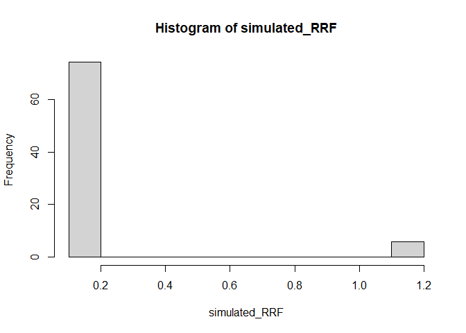
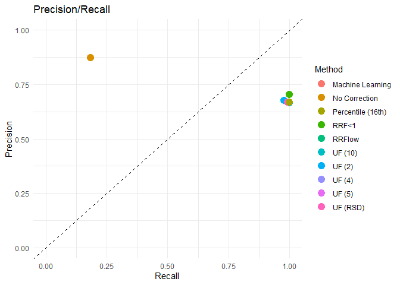

# el_bias


# Libraries

``` r
Sys.setenv(RETICULATE_PYTHON = "C:/Users/misak/anaconda3/python.exe")
#install.packages("tabulapdf")

# Load required packages
library(tidyverse)
```

    Warning: package 'tidyverse' was built under R version 4.4.2

    Warning: package 'ggplot2' was built under R version 4.4.3

    Warning: package 'tidyr' was built under R version 4.4.3

    Warning: package 'dplyr' was built under R version 4.4.3

    Warning: package 'forcats' was built under R version 4.4.2

    Warning: package 'lubridate' was built under R version 4.4.2

    ── Attaching core tidyverse packages ──────────────────────── tidyverse 2.0.0 ──
    ✔ dplyr     1.1.4     ✔ readr     2.1.5
    ✔ forcats   1.0.0     ✔ stringr   1.5.1
    ✔ ggplot2   3.5.1     ✔ tibble    3.2.1
    ✔ lubridate 1.9.4     ✔ tidyr     1.3.1
    ✔ purrr     1.0.2     
    ── Conflicts ────────────────────────────────────────── tidyverse_conflicts() ──
    ✖ dplyr::filter() masks stats::filter()
    ✖ dplyr::lag()    masks stats::lag()
    ℹ Use the conflicted package (<http://conflicted.r-lib.org/>) to force all conflicts to become errors

``` r
library(dplyr)
library(purrr)
library(lubridate)
library(ggplot2)
library(here)
```

    Warning: package 'here' was built under R version 4.4.3

    here() starts at C:/Users/misak/Git-projects/el_bias

``` r
library(parallel)
library(pdftools)
```

    Warning: package 'pdftools' was built under R version 4.4.3

    Using poppler version 23.08.0

``` r
library(stringr)
library(rJava)
library(tabulapdf) # for data tables extraction
```

    Warning: package 'tabulapdf' was built under R version 4.4.3

``` r
library(readxl)
library(reticulate)
```

    Warning: package 'reticulate' was built under R version 4.4.3

``` r
#py_install(c("pandas", "joblib", "scikit-learn"))
```

# Data Extraction

Data for RRFs are coming from the US FDA Clap List.
<https://cdrh-rst.fda.gov/chemicals-list-analytical-performance-clap>

Each file is in a pdf format and contains RRF values for 3 concentration
of a surrogate. LCMS RRFs CLAP Negative Ion Detection.pdf (255.54 KB)
LCMS RRFs CLAP Positive Ion Detection.pdf (279.48 KB) RRF GCMS for
CLAP.pdf (322.77 KB)

They are first extracted to perform the bootstrap simulation. Some data
are n.d. or below DL. The current strategy is to change the n.d. to 0
and below DL to 0.001 based on the input of the Subject Matter Expert.

# GC/MS data

``` r
gcms_clap <- read_excel( 
  path = "processed_data/GCMS.xlsx", 
  sheet = "GC-MS")

gcms_clap_clean <- gcms_clap %>%
  na.omit()

gcms_clap_clean
```

    # A tibble: 92 × 6
       Code  `Trivial Name`                 `CAS #`  `5 µg/mL` `10 µg/mL` `20 µg/mL`
       <chr> <chr>                          <chr>        <dbl>      <dbl>      <dbl>
     1 RM1   Irganox 1010                   6683-19…     0          0          0    
     2 RM2   Irganox 1076                   2082-79…     0.326      0.434      0.336
     3 RM3   Irgafos 168                    31570-0…     0.414      0.393      0.281
     4 RM4   2,6-Di-t-butyl-4- methylphenol 128-37-0     1.83       2.14       1.81 
     5 RM5   2,4-Di-t-butyl phenol          96-76-4      1          1          1    
     6 RM6   2,4-Dimethylphenol             105-67-9     0.71       0.377      0.424
     7 RM7   3-tert-Butyl-4-hydroxyanisole  25013-1…     0.606      0.506      0.583
     8 RM8   Di-(2-ethylhexyl)phthalate     117-81-7     0.823      0.824      0.838
     9 RM9   Dibutylphthalate               84-74-2      0.713      0.744      0.822
    10 RM10  Diphenyl phthalate             84-62-8      0.18       0.437      0.676
    # ℹ 82 more rows

``` r
gcms_clap_clean$"5 µg/mL" <- as.numeric(gcms_clap_clean$"5 µg/mL")
gcms_clap_clean$"10 µg/mL" <- as.numeric(gcms_clap_clean$"10 µg/mL")
gcms_clap_clean$"20 µg/mL" <- as.numeric(gcms_clap_clean$"20 µg/mL")

hist(gcms_clap_clean$"5 µg/mL", 
     main = "Histogram of RRFs for GC/MS with a 5 µg/mL surrogate Concentration", 
     xlab = "RRF",
     col = "skyblue")
```


``` r
hist(gcms_clap_clean$"10 µg/mL", 
     main = "Histogram of RRFs for GC/MS with a 10 µg/mL surrogate Concentration", 
     xlab = "RRF",
     col = "orange")
```


``` r
hist(gcms_clap_clean$"20 µg/mL", 
     main = "Histogram of RRFs for GC/MS with a 20 µg/mL surrogate Concentration", 
     xlab = "RRF",
     col = "red")
```


# LC/MS pos data

``` r
lcmspos_clap <- read_excel( 
  path = "processed_data/LCMS.xlsx", 
  sheet = "LCMSPOS")

lcmspos_clap_clean <- lcmspos_clap %>%
  na.omit()


hist(lcmspos_clap_clean$"5 µg/mL", 
     main = "Histogram of RRFs for GC/MS with a 5 µg/mL surrogate Concentration", 
     xlab = "RRF",
     col = "skyblue")
```


``` r
hist(lcmspos_clap_clean$"10 µg/mL", 
     main = "Histogram of RRFs for GC/MS with a 10 µg/mL surrogate Concentration", 
     xlab = "RRF",
     col = "orange")
```


``` r
hist(lcmspos_clap_clean$"20 µg/mL", 
     main = "Histogram of RRFs for GC/MS with a 20 µg/mL surrogate Concentration", 
     xlab = "RRF",
     col = "red")
```


# LC/MS neg data

``` r
lcmsneg_clap <- read_excel( 
  path = "processed_data/LCMS.xlsx", 
  sheet = "LCMSNEG")

lcmsneg_clap_clean <- lcmsneg_clap %>%
  na.omit()

lcmsneg_clap_clean
```

    # A tibble: 28 × 6
       Code  `Trivial Name`             `CAS #`   `5 µg/mL` `10 µg/mL` `20 µg/mL`
       <chr> <chr>                      <chr>         <dbl>      <dbl>      <dbl>
     1 RM2   Irganox 1076               2082-79-3     0          0          0    
     2 RM4   Butylated hydroxytoluene   128-37-0      0.001      0.001      0.001
     3 RM5   2,4-di-tert-butylphenol    96-76-4       0.001      0.001      0.001
     4 RM8   Di-(2-ethylhexyl)phthalate 117-81-7      0          0          0    
     5 RM13  Caprolactam                105-60-2      0          0          0    
     6 RM14  Bisphenol A                80-05-7       0          0          0    
     7 RM15  Erucamide                  112-84-5      0          0          0    
     8 RM16  Oleamide                   301-02-0      0          0          0    
     9 RM25  Dibenzylamine              103-49-1      0          0          0    
    10 RM26  Benzoic acid               65-85-0       0          0          0    
    # ℹ 18 more rows

``` r
hist(lcmsneg_clap_clean$"5 µg/mL", 
     main = "Histogram of RRFs for GC/MS with a 5 µg/mL surrogate Concentration", 
     xlab = "RRF",
     col = "skyblue")
```


``` r
hist(lcmsneg_clap_clean$"10 µg/mL", 
     main = "Histogram of RRFs for GC/MS with a 10 µg/mL surrogate Concentration", 
     xlab = "RRF",
     col = "orange")
```


``` r
hist(lcmsneg_clap_clean$"20 µg/mL", 
     main = "Histogram of RRFs for GC/MS with a 20 µg/mL surrogate Concentration", 
     xlab = "RRF",
     col = "red")
```


# Generate Base concentration

## Define AET

``` r
AET <- 0.2
```

## Uniform distribution

``` r
set.seed(123)
base_concentrations1 <- runif(100, min = 0.5 * AET, max = 2 * AET)
hist(base_concentrations1)
```


## Log-Normal distribution

$log(0.001) = -6.907, log(100) = 4.605$ \\ $mid (meanlog) approx -1.15$
\\ $width = 4.605 - (-6.907) = 11.51$ \\ $width/6 = 11.51/6=1.91$

``` r
set.seed(123)
base_concentrations2 <- rlnorm(100, meanlog = -1.15, sdlog = 1.91)
hist(base_concentrations2)
```


## Custom distribution

``` r
set.seed(123)
Z <- runif(70, min = 0.001, max = 1)
Y <- runif(20, min = 1, max = 10)
K <- runif(10, min = 10, max = 100)

custom <- c(Z, Y, K)

custom_sampled <- sample(custom, size = 100, replace = FALSE)

hist(custom_sampled)
```


## Normal distribution (simulating a GC/MS RRF distribution)

``` r
set.seed(123)
RRF_norm <- rnorm(50, 1, 0.2)
RRF_norm[RRF_norm<0] <- 0.001 # avoiding negative numbers
hist(RRF_norm)
```


## Log_Normal distribution (simulating a LC/MS RRF distribution)

``` r
set.seed(123)
RRF_lnorm <- rlnorm(50, 0, 0.5)
RRF_lnorm[RRF_lnorm<0] <- 0.001 # avoiding negative numbers
hist(RRF_lnorm)
```


# Scenario with uniform distribution & GC/MS data from US FDA CLAP list

## Initialisation of the comparison table

``` r
summary_table <- data.frame(
  Method = character(),
  FN_Rate = numeric(),
  FP_Rate = numeric(),
  FN_SD = numeric(),
  FP_SD = numeric(),
  precision = numeric(),
  recall = numeric(),
  F1 = numeric(),
  f_beta = numeric()
)
```

## GC-MS No Correction Scenarios

``` r
set.seed(123)
N_sim <- 10000
N_extractables <- 80
total_FN <- 0
total_FP <- 0
total_TP <- 0
total_TN <- 0
total_points <- N_sim * N_extractables

for (i in 1:N_sim) {
## 1) Concentration around the AET
base_conc_sim <- runif(N_extractables, min = 0.5 * AET, max = 2 * AET)
## A) Non-Parametric Bootstrap of the GC/MS dataset (5µg/mL)
simulated_RRF <- sample(gcms_clap_clean$"5 µg/mL", size = N_extractables, replace = FALSE)
## I) No Correction
corrected_conc <- base_conc_sim * simulated_RRF

total_FN <- total_FN + sum((base_conc_sim > AET) & (corrected_conc < AET))
total_FP <- total_FP + sum((base_conc_sim < AET) & (corrected_conc > AET))
total_TP <- total_TP + sum((base_conc_sim > AET) & (corrected_conc > AET))
total_TN <- total_TN + sum((base_conc_sim < AET) & (corrected_conc < AET))

}

FN_Rate_final <- total_FN / total_points
FP_Rate_final <- total_FP / total_points
TP_Rate_final <- total_TP / total_points
TN_Rate_final <- total_TN / total_points
precision <- TP_Rate_final / (TP_Rate_final+FP_Rate_final)
recall <- TP_Rate_final / (TP_Rate_final + FN_Rate_final)
F1 <- (2 * precision * recall / (precision + recall))
beta <- 5
f_beta <- (1 + beta^2) * (precision * recall) / ((beta^2 * precision) + recall)

summary_table <- rbind(summary_table, data.frame(
  Method = "No Correction",
  FN_Rate = FN_Rate_final,
  FP_Rate = FP_Rate_final,
  FN_SD = sqrt(FN_Rate_final * (1 - FN_Rate_final) / total_points),
  FP_SD = sqrt(FP_Rate_final * (1 - FP_Rate_final) / total_points),
  precision = precision,
  recall = recall,
  F1 = F1,
  f_betal = f_beta
))
```

``` r
summary_table
```

             Method   FN_Rate    FP_Rate        FN_SD        FP_SD precision
    1 No Correction 0.5435425 0.01787625 0.0005568932 0.0001481414 0.8736549
         recall        F1   f_betal
    1 0.1852815 0.3057258 0.1910719

``` r
hist(base_conc_sim, 
     main = "Histogram of Base concentration around the AET", 
     xlab = "Concentration",
     col = "skyblue")
```


``` r
hist(simulated_RRF,
     main = "Histogram of RRFs (non-parametric bootstrap of GC/MS dataset 5µg/mL) from FDA Clap list", 
     xlab = "Concentration",
     col = "grey")
```


## GC-MS Correction UF Factor

Uniform concentration around the AET \\ Non Parametric Bootstrap with
replacement of the GC/MS dataset \\ UF correction : from 2, 4, 5, 10 and
UF = 1/(1-RSD)

``` r
#rsd <- function(x) {
  #return(sd(x, na.rm = TRUE) / mean(x, na.rm = TRUE))
#}

rsd <- function(x) {
  x_use = x[x<=1&x>0.05]
  return(sd(x_use, na.rm = TRUE) / mean(x_use, na.rm = TRUE))
}

set.seed(123)
N_sim <- 10000
UF_RSD <- 1/(1 - rsd(gcms_clap_clean$"5 µg/mL")) # formula from ISO 10993-18
UF_list <- c(
  "UF (2)"   = 2, 
  "UF (4)"   = 4, 
  "UF (5)"   = 5, 
  "UF (10)"  = 10, 
  "UF (RSD)" = UF_RSD
)

N_extractables <- 80
total_points <- N_sim * N_extractables

for (m_name in names(UF_list)) {
  uf_val <- UF_list[[m_name]]
  total_FN <- 0
  total_FP <- 0
  total_TP <- 0
  total_TN <- 0
  
  
for (i in 1:N_sim) {
## 1) Concentration around the AET
base_conc_sim <- runif(N_extractables, min = 0.5 * AET, max = 2 * AET)
## A) Non-Parametric Bootstrap of the GC/MS dataset (5µg/mL)
simulated_RRF <- sample(gcms_clap_clean$"5 µg/mL", size = N_extractables, replace = FALSE)
## II) UF corrections
  
  exp_conc <- (base_conc_sim / simulated_RRF)
  corrected_conc <- exp_conc * uf_val 
  
  total_FN <- total_FN + sum((base_conc_sim > AET) & (corrected_conc < AET))
  total_FP <- total_FP + sum((base_conc_sim < AET) & (corrected_conc > AET))
  total_TP <- total_TP + sum((base_conc_sim > AET) & (corrected_conc > AET))
  total_TN <- total_TN + sum((base_conc_sim < AET) & (corrected_conc < AET))

}

FN_Rate_final <- total_FN / total_points
FP_Rate_final <- total_FP / total_points
TP_Rate_final <- total_TP / total_points
TN_Rate_final <- total_TN / total_points
precision <- TP_Rate_final / (TP_Rate_final+FP_Rate_final)
recall <- TP_Rate_final / (TP_Rate_final+TN_Rate_final)
F1 <- (2 * precision * recall / (precision + recall))
beta <- 5
f_beta <- (1 + beta^2) * (precision * recall) / ((beta^2 * precision) + recall)


summary_table <- rbind(summary_table, data.frame(
    Method = m_name,
    FN_Rate = FN_Rate_final,
    FP_Rate = FP_Rate_final,
    FN_SD = sqrt(FN_Rate_final * (1 - FN_Rate_final) / total_points),
    FP_SD = sqrt(FP_Rate_final * (1 - FP_Rate_final) / total_points),
    precision = precision,
    recall = recall,
    F1 = F1,
    f_betal = f_beta
))
}


UF_RSD
```

    [1] 2.864589

``` r
summary_table
```

             Method   FN_Rate    FP_Rate        FN_SD        FP_SD precision
    1 No Correction 0.5435425 0.01787625 5.568932e-04 0.0001481414 0.8736549
    2        UF (2) 0.0020500 0.31849000 5.056923e-05 0.0005208816 0.6761976
    3        UF (4) 0.0000000 0.33262375 0.000000e+00 0.0005267651 0.6670433
    4        UF (5) 0.0000000 0.33340750 0.000000e+00 0.0005270756 0.6665696
    5       UF (10) 0.0000000 0.33379750 0.000000e+00 0.0005272295 0.6662025
    6      UF (RSD) 0.0000000 0.32922250 0.000000e+00 0.0005253987 0.6693341
         recall        F1   f_betal
    1 0.1852815 0.3057258 0.1910719
    2 0.9788711 0.7998584 0.9623042
    3 0.9985016 0.7997909 0.9797763
    4 0.9998969 0.7998971 0.9810285
    5 1.0000000 0.7996657 0.9810934
    6 0.9934926 0.7998170 0.9753253

## GC-MS Correction Factor percentile

``` r
percentile <- function(x) {
  return(quantile(x, .16))
}

set.seed(123)
N_sim <- 10000
N_extractables <- 80
total_FN <- 0
total_FP <- 0
total_TP <- 0
total_TN <- 0
total_points <- N_sim * N_extractables


for (i in 1:N_sim) {
## 1) Concentration around the AET
base_conc_sim <- runif(N_extractables, min = 0.5 * AET, max = 2 * AET)
## A) Non-Parametric Bootstrap of the GC/MS dataset (5µg/mL)
simulated_RRF <- sample(gcms_clap_clean$"5 µg/mL", size = N_extractables, replace = FALSE)
exp_conc <- (base_conc_sim / simulated_RRF)
## III) 16th percentile Correction
corrected_conc <- exp_conc * (mean(simulated_RRF) / percentile(simulated_RRF))

total_FN <- total_FN + sum((base_conc_sim > AET) & (corrected_conc < AET))
total_FP <- total_FP + sum((base_conc_sim < AET) & (corrected_conc > AET))
total_TP <- total_TP + sum((base_conc_sim > AET) & (corrected_conc > AET))
total_TN <- total_TN + sum((base_conc_sim < AET) & (corrected_conc < AET))

}

FN_Rate_final <- total_FN / total_points
FP_Rate_final <- total_FP / total_points
TP_Rate_final <- total_TP / total_points
TN_Rate_final <- total_TN / total_points
precision <- TP_Rate_final / (TP_Rate_final+FP_Rate_final)
recall <- TP_Rate_final / (TP_Rate_final + FN_Rate_final)
F1 <- (2 * precision * recall / (precision + recall))
beta <- 5
f_beta <- (1 + beta^2) * (precision * recall) / ((beta^2 * precision) + recall)

summary_table <- rbind(summary_table, data.frame(
  Method = "Percentile (16th)",
  FN_Rate = FN_Rate_final,
  FP_Rate = FP_Rate_final,
  FN_SD = sqrt(FN_Rate_final * (1 - FN_Rate_final) / total_points),
  FP_SD = sqrt(FP_Rate_final * (1 - FP_Rate_final) / total_points),
  precision = precision,
  recall = recall,
  F1 = F1,
  f_betal = f_beta
))
```

## GC-MS Correction RRFlow

``` r
set.seed(123)
N_sim <- 10000
N_extractables <- 80
total_FN <- 0
total_FP <- 0
total_TP <- 0
total_TN <- 0
total_points <- N_sim * N_extractables

RRF_GCMS_superior0 <- gcms_clap_clean$"5 µg/mL"
RRF_GCMS_superior0 <- RRF_GCMS_superior0[RRF_GCMS_superior0 > 0]

for (i in 1:N_sim) {

## 1) Concentration around the AET
base_conc_sim <- runif(N_extractables, min = 0.5 * AET, max = 2 * AET)
## A) Non-Parametric Bootstrap of the GC/MS dataset (5µg/mL)
simulated_RRF <- sample(gcms_clap_clean$"5 µg/mL", size = N_extractables, replace = FALSE)
## IV) RRflow condition

exp_conc <- base_conc_sim * simulated_RRF
corrected_conc <- exp_conc
condition <- (simulated_RRF < 0.5) | (simulated_RRF > 2)
corrected_conc[condition] <- exp_conc[condition] / simulated_RRF[condition]

total_FN <- total_FN + sum((base_conc_sim > AET) & (corrected_conc < AET))
total_FP <- total_FP + sum((base_conc_sim < AET) & (corrected_conc > AET))
total_TP <- total_TP + sum((base_conc_sim > AET) & (corrected_conc > AET))
total_TN <- total_TN + sum((base_conc_sim < AET) & (corrected_conc < AET))

}

FN_Rate_final <- total_FN / total_points
FP_Rate_final <- total_FP / total_points
TP_Rate_final <- total_TP / total_points
TN_Rate_final <- total_TN / total_points
precision <- TP_Rate_final / (TP_Rate_final+FP_Rate_final)
recall <- TP_Rate_final / (TP_Rate_final + FN_Rate_final)
F1 <- (2 * precision * recall / (precision + recall))
beta <- 5
f_beta <- (1 + beta^2) * (precision * recall) / ((beta^2 * precision) + recall)

summary_table <- rbind(summary_table, data.frame(
  Method = "RRFlow",
  FN_Rate = FN_Rate_final,
  FP_Rate = FP_Rate_final,
  FN_SD = sqrt(FN_Rate_final * (1 - FN_Rate_final) / total_points),
  FP_SD = sqrt(FP_Rate_final * (1 - FP_Rate_final) / total_points),
  precision = precision,
  recall = recall,
  F1 = F1,
  f_betal = f_beta
))
```

``` r
summary_table
```

                 Method   FN_Rate    FP_Rate        FN_SD        FP_SD precision
    1     No Correction 0.5435425 0.01787625 5.568932e-04 0.0001481414 0.8736549
    2            UF (2) 0.0020500 0.31849000 5.056923e-05 0.0005208816 0.6761976
    3            UF (4) 0.0000000 0.33262375 0.000000e+00 0.0005267651 0.6670433
    4            UF (5) 0.0000000 0.33340750 0.000000e+00 0.0005270756 0.6665696
    5           UF (10) 0.0000000 0.33379750 0.000000e+00 0.0005272295 0.6662025
    6          UF (RSD) 0.0000000 0.32922250 0.000000e+00 0.0005253987 0.6693341
    7 Percentile (16th) 0.0000000 0.33284625 0.000000e+00 0.0005268534 0.6671537
    8            RRFlow        NA         NA           NA           NA        NA
         recall        F1   f_betal
    1 0.1852815 0.3057258 0.1910719
    2 0.9788711 0.7998584 0.9623042
    3 0.9985016 0.7997909 0.9797763
    4 0.9998969 0.7998971 0.9810285
    5 1.0000000 0.7996657 0.9810934
    6 0.9934926 0.7998170 0.9753253
    7 1.0000000 0.8003506 0.9811726
    8        NA        NA        NA

## GC-MS Correction RRF \< 1

Uniform concentration around the AET \\ Non Parametric Bootstrap with
replacement of the GC/MS dataset \\ Correction by applying condition on
the RRFs.

``` r
set.seed(123)
N_sim <- 10000
N_extractables <- 80
total_FN <- 0
total_FP <- 0
total_TP <- 0
total_TN <- 0
total_points <- N_sim * N_extractables

RRF_GCMS_superior0 <- gcms_clap_clean$"5 µg/mL"
RRF_GCMS_superior0 <- RRF_GCMS_superior0[RRF_GCMS_superior0 > 0]

for (i in 1:N_sim) {

## 1) Concentration around the AET
base_conc_sim <- runif(N_extractables, min = 0.5 * AET, max = 2 * AET)
## A) Non-Parametric Bootstrap of the GC/MS dataset (5µg/mL)
simulated_RRF <- sample(gcms_clap_clean$"5 µg/mL", size = N_extractables, replace = FALSE)
## V RRF < 1

corrected_conc <- base_conc_sim
condition <- (simulated_RRF < 1)
corrected_conc[condition] <- corrected_conc[condition] / simulated_RRF[condition]


total_FN <- total_FN + sum((base_conc_sim > AET) & (corrected_conc < AET))
total_FP <- total_FP + sum((base_conc_sim < AET) & (corrected_conc > AET))
total_TP <- total_TP + sum((base_conc_sim > AET) & (corrected_conc > AET))
total_TN <- total_TN + sum((base_conc_sim < AET) & (corrected_conc < AET))

}

FN_Rate_final <- total_FN / total_points
FP_Rate_final <- total_FP / total_points
TP_Rate_final <- total_TP / total_points
TN_Rate_final <- total_TN / total_points
precision <- TP_Rate_final / (TP_Rate_final+FP_Rate_final)
recall <- TP_Rate_final / (TP_Rate_final + FN_Rate_final)
F1 <- (2 * precision * recall / (precision + recall))
beta <- 5
f_beta <- (1 + beta^2) * (precision * recall) / ((beta^2 * precision) + recall)

summary_table <- rbind(summary_table, data.frame(
  Method = "RRF<1",
  FN_Rate = FN_Rate_final,
  FP_Rate = FP_Rate_final,
  FN_SD = sqrt(FN_Rate_final * (1 - FN_Rate_final) / total_points),
  FP_SD = sqrt(FP_Rate_final * (1 - FP_Rate_final) / total_points),
  precision = precision,
  recall = recall,
  F1 = F1,
  f_betal = f_beta
))
```

## Machine Learning

Loading the ML Model

``` python
import joblib
import pandas as pd

# Load the model and the feature list
model = joblib.load('rf_rrf_model.joblib')
```

    C:\Users\misak\ANACON~1\Lib\site-packages\sklearn\base.py:376: InconsistentVersionWarning: Trying to unpickle estimator DecisionTreeRegressor from version 1.7.2 when using version 1.5.1. This might lead to breaking code or invalid results. Use at your own risk. For more info please refer to:
    https://scikit-learn.org/stable/model_persistence.html#security-maintainability-limitations
      warnings.warn(
    C:\Users\misak\ANACON~1\Lib\site-packages\sklearn\base.py:376: InconsistentVersionWarning: Trying to unpickle estimator RandomForestRegressor from version 1.7.2 when using version 1.5.1. This might lead to breaking code or invalid results. Use at your own risk. For more info please refer to:
    https://scikit-learn.org/stable/model_persistence.html#security-maintainability-limitations
      warnings.warn(

``` python
feats = joblib.load('features.joblib')

def predict_rrf_raw(df):
    return model.predict(df[feats])
```

``` r
gc_ms <- read_csv("final_model_data.csv") %>%
  drop_na(BP, `Refractive Index`, TPSA, NHOHCount, NumHDonors, NumRotatableBonds, NOCount) 
```

    Rows: 92 Columns: 35
    ── Column specification ────────────────────────────────────────────────────────
    Delimiter: ","
    chr  (6): Code, IUPAC name, CAS #, Empirical Formula, pKa, SMILES
    dbl (29): DBE, MW, BP, logP, Refractive Index, 5 µg/mL, 10 µg/mL, 20 µg/mL, ...

    ℹ Use `spec()` to retrieve the full column specification for this data.
    ℹ Specify the column types or set `show_col_types = FALSE` to quiet this message.

``` r
set.seed(123)
N_sim <- 10000
N_extractables <- 80
total_FN <- 0
total_FP <- 0
total_TP <- 0
total_TN <- 0

total_points <- N_sim * N_extractables

for (i in 1:N_sim) {
sim_data <- gc_ms %>% 
  sample_n(N_extractables, replace = TRUE)
  
## 1) Concentration around the AET
base_conc_sim <- runif(N_extractables, min = 0.5 * AET, max = 2 * AET)
## VI) RRF generated via the machine learning
simulated_RRF <- py$predict_rrf_raw(sim_data)
## no correction
corrected_conc <- base_conc_sim * simulated_RRF


total_FN <- total_FN + sum((base_conc_sim > AET) & (corrected_conc < AET))
total_FP <- total_FP + sum((base_conc_sim < AET) & (corrected_conc > AET))
total_TP <- total_TP + sum((base_conc_sim > AET) & (corrected_conc > AET))
total_TN <- total_TN + sum((base_conc_sim < AET) & (corrected_conc < AET))

}

FN_Rate_final <- total_FN / total_points
FP_Rate_final <- total_FP / total_points
TP_Rate_final <- total_TP / total_points
TN_Rate_final <- total_TN / total_points
precision <- TP_Rate_final / (TP_Rate_final+FP_Rate_final)
recall <- TP_Rate_final / (TP_Rate_final + FN_Rate_final)
F1 <- (2 * precision * recall / (precision + recall))
beta <- 5
f_beta <- (1 + beta^2) * (precision * recall) / ((beta^2 * precision) + recall)


summary_table <- rbind(summary_table, data.frame(
  Method = "Machine Learning",
  FN_Rate = FN_Rate_final,
  FP_Rate = FP_Rate_final,
  FN_SD = sqrt(FN_Rate_final * (1 - FN_Rate_final) / total_points),
  FP_SD = sqrt(FP_Rate_final * (1 - FP_Rate_final) / total_points),
  precision = precision,
  recall = recall,
  F1 = F1,
  f_betal = f_beta
))
```

``` r
summary_table
```

                  Method   FN_Rate    FP_Rate        FN_SD        FP_SD precision
    1      No Correction 0.5435425 0.01787625 5.568932e-04 0.0001481414 0.8736549
    2             UF (2) 0.0020500 0.31849000 5.056923e-05 0.0005208816 0.6761976
    3             UF (4) 0.0000000 0.33262375 0.000000e+00 0.0005267651 0.6670433
    4             UF (5) 0.0000000 0.33340750 0.000000e+00 0.0005270756 0.6665696
    5            UF (10) 0.0000000 0.33379750 0.000000e+00 0.0005272295 0.6662025
    6           UF (RSD) 0.0000000 0.32922250 0.000000e+00 0.0005253987 0.6693341
    7  Percentile (16th) 0.0000000 0.33284625 0.000000e+00 0.0005268534 0.6671537
    8             RRFlow        NA         NA           NA           NA        NA
    9              RRF<1 0.0000000 0.27956625 0.000000e+00 0.0005017581 0.7047002
    10  Machine Learning 0.6663025 0.00000000 5.271900e-04 0.0000000000       NaN
          recall        F1   f_betal
    1  0.1852815 0.3057258 0.1910719
    2  0.9788711 0.7998584 0.9623042
    3  0.9985016 0.7997909 0.9797763
    4  0.9998969 0.7998971 0.9810285
    5  1.0000000 0.7996657 0.9810934
    6  0.9934926 0.7998170 0.9753253
    7  1.0000000 0.8003506 0.9811726
    8         NA        NA        NA
    9  1.0000000 0.8267732 0.9841386
    10 0.0000000       NaN       NaN

``` r
hist(simulated_RRF)
```



``` r
summary_table
```

                  Method   FN_Rate    FP_Rate        FN_SD        FP_SD precision
    1      No Correction 0.5435425 0.01787625 5.568932e-04 0.0001481414 0.8736549
    2             UF (2) 0.0020500 0.31849000 5.056923e-05 0.0005208816 0.6761976
    3             UF (4) 0.0000000 0.33262375 0.000000e+00 0.0005267651 0.6670433
    4             UF (5) 0.0000000 0.33340750 0.000000e+00 0.0005270756 0.6665696
    5            UF (10) 0.0000000 0.33379750 0.000000e+00 0.0005272295 0.6662025
    6           UF (RSD) 0.0000000 0.32922250 0.000000e+00 0.0005253987 0.6693341
    7  Percentile (16th) 0.0000000 0.33284625 0.000000e+00 0.0005268534 0.6671537
    8             RRFlow        NA         NA           NA           NA        NA
    9              RRF<1 0.0000000 0.27956625 0.000000e+00 0.0005017581 0.7047002
    10  Machine Learning 0.6663025 0.00000000 5.271900e-04 0.0000000000       NaN
          recall        F1   f_betal
    1  0.1852815 0.3057258 0.1910719
    2  0.9788711 0.7998584 0.9623042
    3  0.9985016 0.7997909 0.9797763
    4  0.9998969 0.7998971 0.9810285
    5  1.0000000 0.7996657 0.9810934
    6  0.9934926 0.7998170 0.9753253
    7  1.0000000 0.8003506 0.9811726
    8         NA        NA        NA
    9  1.0000000 0.8267732 0.9841386
    10 0.0000000       NaN       NaN

## Comparison

``` r
plot_data <- summary_table %>%
  pivot_longer(cols = c(FN_Rate, FP_Rate), names_to = "Type", values_to = "Rate") %>%
  mutate(
    SD = ifelse(Type == "FN_Rate", round(FN_SD*100, 2), round(FP_SD*100, 2)),
    Type = ifelse(Type == "FN_Rate", "False Negative", "False Positive")
  )

method_levels <- c(
  "No Correction",
  "UF (2)", 
  "UF (4)", 
  "UF (5)", 
  "UF (10)",  
  "UF (RSD)",
  "Percentile (16th)", 
  "RRFlow",
  "RRF<1",
  "Machine Learning")

plot_data$Method <- factor(plot_data$Method, levels = method_levels)


ggplot(plot_data, aes(x = Method, y = Rate*100, fill = Type)) +
  geom_bar(stat = "identity", position = position_dodge(width = 0.9), alpha = 0.8) +
  geom_errorbar(aes(ymin = pmax(0, Rate*100 - 1.96*SD), ymax = Rate*100 + 1.96*SD), 
                position = position_dodge(width = 0.9), width = 0.2) +
  labs(
    title = paste0("Comparison of GC-MS Correction Methods (5 µg/mL)", " AET=", AET, "µg/mL"),
    subtitle = "Conc. Uniform distribution (around AET), RRF sampled from CLAP list data",
    y = "Rate (%)",
    x = "Method") +
  geom_text(aes(label = sprintf("%.1f%%", Rate*100)), position = position_dodge(width = 0.9), hjust = -0.5, size = 3, vjust = 0.1) +
  scale_fill_manual(values = c("False Negative" = "red", "False Positive" = "grey")) + 
  scale_y_continuous(limits = c(0, 100)) +
  theme_minimal() +
  coord_flip()
```

    Warning: Removed 2 rows containing missing values or values outside the scale range
    (`geom_bar()`).

    Warning: Removed 2 rows containing missing values or values outside the scale range
    (`geom_text()`).


``` r
summary_table %>%
  select(Method, precision, recall, F1, f_betal)
```

                  Method precision    recall        F1   f_betal
    1      No Correction 0.8736549 0.1852815 0.3057258 0.1910719
    2             UF (2) 0.6761976 0.9788711 0.7998584 0.9623042
    3             UF (4) 0.6670433 0.9985016 0.7997909 0.9797763
    4             UF (5) 0.6665696 0.9998969 0.7998971 0.9810285
    5            UF (10) 0.6662025 1.0000000 0.7996657 0.9810934
    6           UF (RSD) 0.6693341 0.9934926 0.7998170 0.9753253
    7  Percentile (16th) 0.6671537 1.0000000 0.8003506 0.9811726
    8             RRFlow        NA        NA        NA        NA
    9              RRF<1 0.7047002 1.0000000 0.8267732 0.9841386
    10  Machine Learning       NaN 0.0000000       NaN       NaN

ROC and Precision Recall plots

``` r
ggplot(summary_table, aes(x = FP_Rate, y = recall, color = Method)) +
  geom_point(size = 4) +
  geom_abline(slope = 1, intercept = 0, linetype = "dashed") + 
  xlim(0, 1) + ylim(0, 1) +
  labs(title = "ROC",
       x = "False Positive Rate (1-Specificity)",
       y = "Recall (Sensitivity)") +
  theme_minimal()
```

    Warning: Removed 1 row containing missing values or values outside the scale range
    (`geom_point()`).


``` r
ggplot(summary_table, aes(x = recall, y = precision, color = Method)) +
  geom_point(size = 4) +
  geom_abline(slope = 1, intercept = 0, linetype = "dashed") + # Random guess line
  xlim(0, 1) + ylim(0, 1) +
  labs(title = "Precision/Recall",
       x = "Recall",
       y = "Precision") +
  theme_minimal()
```

    Warning: Removed 2 rows containing missing values or values outside the scale range
    (`geom_point()`).


