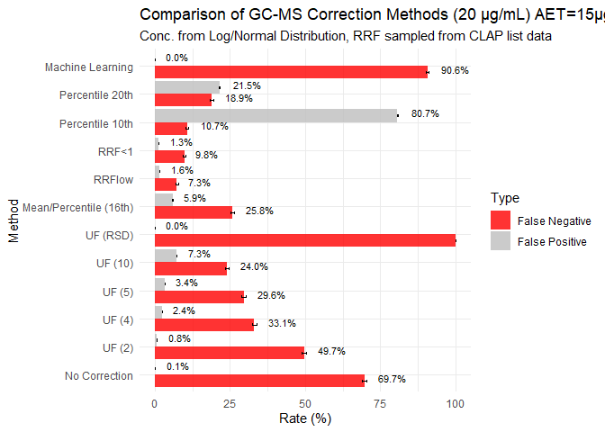
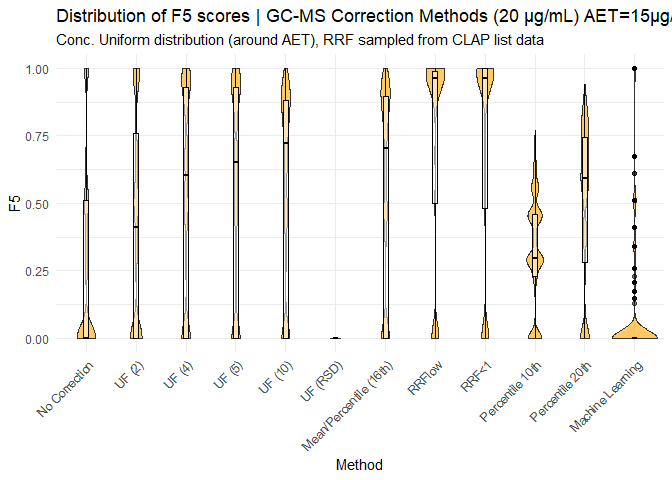
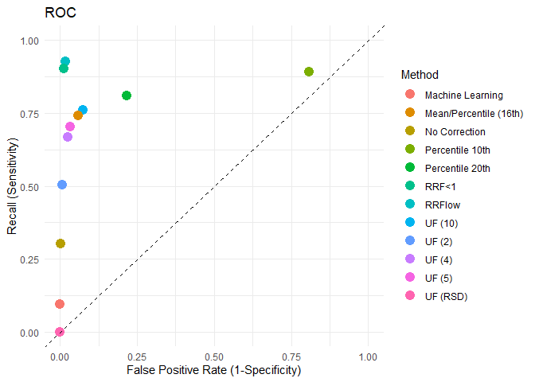
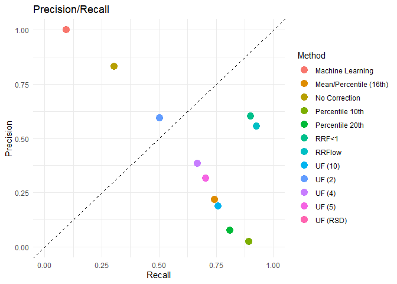

# el_bias


# Libraries

``` r
Sys.setenv(RETICULATE_PYTHON = "C:/Users/misak/anaconda3/python.exe")

#install.packages("tabulapdf")

# Load required packages
library(tidyverse)
```

    Warning: package 'tidyverse' was built under R version 4.4.2

    Warning: package 'ggplot2' was built under R version 4.4.3

    Warning: package 'tidyr' was built under R version 4.4.3

    Warning: package 'dplyr' was built under R version 4.4.3

    Warning: package 'forcats' was built under R version 4.4.2

    Warning: package 'lubridate' was built under R version 4.4.2

    ── Attaching core tidyverse packages ──────────────────────── tidyverse 2.0.0 ──
    ✔ dplyr     1.1.4     ✔ readr     2.1.5
    ✔ forcats   1.0.0     ✔ stringr   1.5.1
    ✔ ggplot2   3.5.1     ✔ tibble    3.2.1
    ✔ lubridate 1.9.4     ✔ tidyr     1.3.1
    ✔ purrr     1.0.2     
    ── Conflicts ────────────────────────────────────────── tidyverse_conflicts() ──
    ✖ dplyr::filter() masks stats::filter()
    ✖ dplyr::lag()    masks stats::lag()
    ℹ Use the conflicted package (<http://conflicted.r-lib.org/>) to force all conflicts to become errors

``` r
library(dplyr)
library(purrr)
library(lubridate)
library(ggplot2)
library(here)
```

    Warning: package 'here' was built under R version 4.4.3

    here() starts at C:/Users/misak/Git-projects/el_bias

``` r
library(parallel)
library(pdftools)
```

    Warning: package 'pdftools' was built under R version 4.4.3

    Using poppler version 23.08.0

``` r
library(stringr)
library(rJava)
library(tabulapdf) # for data tables extraction
```

    Warning: package 'tabulapdf' was built under R version 4.4.3

``` r
library(readxl)
library(reticulate)
```

    Warning: package 'reticulate' was built under R version 4.4.3

``` r
#py_install(c("pandas", "joblib", "scikit-learn"))
```

# Data Extraction

Data for RRFs are coming from the US FDA Clap List.
<https://cdrh-rst.fda.gov/chemicals-list-analytical-performance-clap>

Each file is in a pdf format and contains RRF values for 3 concentration
of a surrogate. LCMS RRFs CLAP Negative Ion Detection.pdf (255.54 KB)
LCMS RRFs CLAP Positive Ion Detection.pdf (279.48 KB) RRF GCMS for
CLAP.pdf (322.77 KB)

They are first extracted to perform the bootstrap simulation. Some data
are n.d. or below DL. The current strategy is to change the n.d. to 0
and below DL to 0.001 based on the input of the Subject Matter Expert.

# GC/MS data

``` r
gcms_clap <- read_excel( 
  path = "processed_data/GCMS.xlsx", 
  sheet = "GC-MS")

gcms_clap_clean <- gcms_clap %>%
  na.omit()

gcms_clap_clean
```

    # A tibble: 92 × 6
       Code  `Trivial Name`                 `CAS #`  `5 µg/mL` `10 µg/mL` `20 µg/mL`
       <chr> <chr>                          <chr>        <dbl>      <dbl>      <dbl>
     1 RM1   Irganox 1010                   6683-19…     0          0          0    
     2 RM2   Irganox 1076                   2082-79…     0.326      0.434      0.336
     3 RM3   Irgafos 168                    31570-0…     0.414      0.393      0.281
     4 RM4   2,6-Di-t-butyl-4- methylphenol 128-37-0     1.83       2.14       1.81 
     5 RM5   2,4-Di-t-butyl phenol          96-76-4      1          1          1    
     6 RM6   2,4-Dimethylphenol             105-67-9     0.71       0.377      0.424
     7 RM7   3-tert-Butyl-4-hydroxyanisole  25013-1…     0.606      0.506      0.583
     8 RM8   Di-(2-ethylhexyl)phthalate     117-81-7     0.823      0.824      0.838
     9 RM9   Dibutylphthalate               84-74-2      0.713      0.744      0.822
    10 RM10  Diphenyl phthalate             84-62-8      0.18       0.437      0.676
    # ℹ 82 more rows

``` r
gcms_clap_clean$"5 µg/mL" <- as.numeric(gcms_clap_clean$"5 µg/mL")
gcms_clap_clean$"10 µg/mL" <- as.numeric(gcms_clap_clean$"10 µg/mL")
gcms_clap_clean$"20 µg/mL" <- as.numeric(gcms_clap_clean$"20 µg/mL")

hist(gcms_clap_clean$"5 µg/mL", 
     main = "Histogram of RRFs for GC/MS with a 5 µg/mL surrogate Concentration", 
     xlab = "RRF",
     col = "skyblue")
```


``` r
hist(gcms_clap_clean$"10 µg/mL", 
     main = "Histogram of RRFs for GC/MS with a 10 µg/mL surrogate Concentration", 
     xlab = "RRF",
     col = "orange")
```


``` r
hist(gcms_clap_clean$"20 µg/mL", 
     main = "Histogram of RRFs for GC/MS with a 20 µg/mL surrogate Concentration", 
     xlab = "RRF",
     col = "red")
```


# LC/MS pos data

``` r
lcmspos_clap <- read_excel( 
  path = "processed_data/LCMS.xlsx", 
  sheet = "LCMSPOS")

lcmspos_clap_clean <- lcmspos_clap %>%
  na.omit()


hist(lcmspos_clap_clean$"5 µg/mL", 
     main = "Histogram of RRFs for LC/MS+ with a 5 µg/mL surrogate Concentration", 
     xlab = "RRF",
     col = "skyblue")
```


``` r
hist(lcmspos_clap_clean$"10 µg/mL", 
     main = "Histogram of RRFs for LC/MS+ with a 10 µg/mL surrogate Concentration", 
     xlab = "RRF",
     col = "orange")
```


``` r
hist(lcmspos_clap_clean$"20 µg/mL", 
     main = "Histogram of RRFs for LC/MS+ with a 20 µg/mL surrogate Concentration", 
     xlab = "RRF",
     col = "red")
```


# LC/MS neg data

``` r
lcmsneg_clap <- read_excel( 
  path = "processed_data/LCMS.xlsx", 
  sheet = "LCMSNEG")

lcmsneg_clap_clean <- lcmsneg_clap %>%
  na.omit()

lcmsneg_clap_clean
```

    # A tibble: 28 × 6
       Code  `Trivial Name`             `CAS #`   `5 µg/mL` `10 µg/mL` `20 µg/mL`
       <chr> <chr>                      <chr>         <dbl>      <dbl>      <dbl>
     1 RM2   Irganox 1076               2082-79-3     0          0          0    
     2 RM4   Butylated hydroxytoluene   128-37-0      0.001      0.001      0.001
     3 RM5   2,4-di-tert-butylphenol    96-76-4       0.001      0.001      0.001
     4 RM8   Di-(2-ethylhexyl)phthalate 117-81-7      0          0          0    
     5 RM13  Caprolactam                105-60-2      0          0          0    
     6 RM14  Bisphenol A                80-05-7       0          0          0    
     7 RM15  Erucamide                  112-84-5      0          0          0    
     8 RM16  Oleamide                   301-02-0      0          0          0    
     9 RM25  Dibenzylamine              103-49-1      0          0          0    
    10 RM26  Benzoic acid               65-85-0       0          0          0    
    # ℹ 18 more rows

``` r
hist(lcmsneg_clap_clean$"5 µg/mL", 
     main = "Histogram of RRFs for LC/MS- with a 5 µg/mL surrogate Concentration", 
     xlab = "RRF",
     col = "skyblue")
```


``` r
hist(lcmsneg_clap_clean$"10 µg/mL", 
     main = "Histogram of RRFs for LC/MS- with a 10 µg/mL surrogate Concentration", 
     xlab = "RRF",
     col = "orange")
```


``` r
hist(lcmsneg_clap_clean$"20 µg/mL", 
     main = "Histogram of RRFs for LC/MS- with a 20 µg/mL surrogate Concentration", 
     xlab = "RRF",
     col = "red")
```


# Generate Base concentration

## Define AET

``` r
AET <- 15
```

## Uniform distribution

``` r
set.seed(123)
base_concentrations1 <- runif(100, min = 0.5 * AET, max = 2 * AET)
hist(base_concentrations1)
```


## Log-Normal distribution

$log(0.001) = -6.907, log(100) = 4.605$ \\ $mid (meanlog) approx -1.15$
\\ $width = 4.605 - (-6.907) = 11.51$ \\ $width/6 = 11.51/6=1.91$

``` r
set.seed(123)
base_concentrations2 <- rlnorm(100, meanlog = -1.15, sdlog = 1.91)
hist(base_concentrations2)
```


## Custom distribution

``` r
set.seed(123)
Z <- runif(70, min = 0.001, max = 1)
Y <- runif(20, min = 1, max = 10)
K <- runif(10, min = 10, max = 100)

custom <- c(Z, Y, K)

custom_sampled <- sample(custom, size = 100, replace = FALSE)

hist(custom_sampled)
```


## Normal distribution (simulating a GC/MS RRF distribution)

``` r
set.seed(123)
RRF_norm <- rnorm(50, 1, 0.2)
RRF_norm[RRF_norm<0] <- 0.001 # avoiding negative numbers
hist(RRF_norm)
```


## Log_Normal distribution (simulating a LC/MS RRF distribution)

``` r
set.seed(123)
RRF_lnorm <- rlnorm(50, 0, 0.5)
RRF_lnorm[RRF_lnorm<0] <- 0.001 # avoiding negative numbers
hist(RRF_lnorm)
```


# Scenario with uniform distribution & GC/MS data from US FDA CLAP list

## Initialisation of the comparison table

``` r
summary_table <- data.frame(
  Method = character(),
  FN_Rate = numeric(),
  FP_Rate = numeric(),
  FN_SD = numeric(),
  FP_SD = numeric(),
  precision = numeric(),
  recall = numeric(),
  F1 = numeric(),
  f_beta = numeric()
)
all_distributions <- data.frame()
```

## GC-MS No Correction Scenarios

``` r
set.seed(123)
N_sim <- 10000
N_extractables <- 80
total_FN <- 0
total_FP <- 0
total_TP <- 0
total_TN <- 0
dist_f1 <- numeric(N_sim)
dist_f5 <- numeric(N_sim)
beta <- 5

for (i in 1:N_sim) {
## 2) Concentration from the log-normal distribution
base_conc_sim <- rlnorm(N_extractables, meanlog = -1.15, sdlog = 1.91)
## A) Sampling from the GC/MS dataset (5µg/mL)
simulated_RRF <- sample(gcms_clap_clean$"20 µg/mL", size = N_extractables, replace = FALSE)
## I) No Correction
corrected_conc <- base_conc_sim * simulated_RRF

is_above_threshold <- base_conc_sim > AET
reported_above_threshold <- corrected_conc > AET

 iter_TP <- sum(is_above_threshold & reported_above_threshold, na.rm = TRUE)
  iter_FP <- sum(!is_above_threshold & reported_above_threshold, na.rm = TRUE)
  iter_FN <- sum(is_above_threshold & !reported_above_threshold, na.rm = TRUE)
  iter_TN <- sum(!is_above_threshold & !reported_above_threshold, na.rm = TRUE)

  total_TP <- total_TP + iter_TP
  total_FP <- total_FP + iter_FP
  total_FN <- total_FN + iter_FN
  total_TN <- total_TN + iter_TN

  # metrics per iterations
  iter_prec <- if((iter_TP + iter_FP) > 0) iter_TP / (iter_TP + iter_FP) else 0
  iter_rec  <- if((iter_TP + iter_FN) > 0) iter_TP / (iter_TP + iter_FN) else 0
  
  # F1
  iter_f1 <- if((iter_prec + iter_rec) > 0) {
    (2 * iter_prec * iter_rec) / (iter_prec + iter_rec)
  } else { 0 }
  
  # F5
  denom_beta <- (beta^2 * iter_prec) + iter_rec
  iter_fbeta <- if(denom_beta > 0) {
    ((1 + beta^2) * (iter_prec * iter_rec)) / denom_beta
  } else { 0 }
  
  dist_f1[i]   <- iter_f1
  dist_f5[i]   <- iter_fbeta
}

count_Above_AET <- total_TP + total_FN
count_Below_AET  <- total_TN + total_FP
FN_Rate_final <- total_FN / count_Above_AET
FP_Rate_final <- total_FP / count_Below_AET

recall <- total_TP / count_Above_AET
precision <- total_TP / (total_TP + total_FP)

F1 <- (2 * precision * recall / (precision + recall))
beta <- 5
f_beta <- (1 + beta^2) * (precision * recall) / ((beta^2 * precision) + recall)

SD_FN <- sqrt(FN_Rate_final * (1 - FN_Rate_final) / count_Above_AET)
SD_FP <- sqrt(FP_Rate_final * (1 - FP_Rate_final) / count_Below_AET)

summary_table <- rbind(summary_table, data.frame(
  Method = "No Correction",
  FN_Rate = FN_Rate_final,
  FP_Rate = FP_Rate_final,
  FN_SD = SD_FN,
  FP_SD = SD_FP,
  precision = precision,
  recall = recall,
  F1 = F1,
  f_beta = f_beta
))

metrics_df <- data.frame(
  Method = "No Correction",
  F1 = dist_f1,
  F5 = dist_f5
)

all_distributions <- rbind(all_distributions, metrics_df)
```

``` r
hist(base_conc_sim, 
     main = "Histogram of Base concentration around the AET", 
     xlab = "Concentration",
     col = "skyblue")
```


``` r
hist(simulated_RRF,
     main = "Histogram of RRFs (non-parametric bootstrap of GC/MS dataset 5µg/mL) from FDA Clap list", 
     xlab = "Concentration",
     col = "grey")
```


## GC-MS Correction UF Factor

``` r
rsd <- function(x) {
  return(sd(x, na.rm = TRUE) / mean(x, na.rm = TRUE))
}


set.seed(123)
N_sim <- 10000
UF_RSD <- 1/(1 - rsd(gcms_clap_clean$"20 µg/mL")) # formula from ISO 10993-18
UF_list <- c(
  "UF (2)"   = 2, 
  "UF (4)"   = 4, 
  "UF (5)"   = 5, 
  "UF (10)"  = 10, 
  "UF (RSD)" = UF_RSD
)

N_extractables <- 80

for (m_name in names(UF_list)) {
  uf_val <- UF_list[[m_name]]
  total_FN <- 0
  total_FP <- 0
  total_TP <- 0
  total_TN <- 0
  
  
for (i in 1:N_sim) {
## 2) Concentration from the log-normal distribution
base_conc_sim <- rlnorm(N_extractables, meanlog = -1.15, sdlog = 1.91)
## A) Sampling from the GC/MS dataset (5µg/mL)
simulated_RRF <- sample(gcms_clap_clean$"20 µg/mL", size = N_extractables, replace = FALSE)
## II) UF corrections
  
  exp_conc <- (base_conc_sim * simulated_RRF)
  corrected_conc <- exp_conc * uf_val 
  
  is_above_threshold <- base_conc_sim > AET
  reported_above_threshold <- corrected_conc > AET

 iter_TP <- sum(is_above_threshold & reported_above_threshold, na.rm = TRUE)
  iter_FP <- sum(!is_above_threshold & reported_above_threshold, na.rm = TRUE)
  iter_FN <- sum(is_above_threshold & !reported_above_threshold, na.rm = TRUE)
  iter_TN <- sum(!is_above_threshold & !reported_above_threshold, na.rm = TRUE)

  total_TP <- total_TP + iter_TP
  total_FP <- total_FP + iter_FP
  total_FN <- total_FN + iter_FN
  total_TN <- total_TN + iter_TN

  # metrics per iterations
  iter_prec <- if((iter_TP + iter_FP) > 0) iter_TP / (iter_TP + iter_FP) else 0
  iter_rec  <- if((iter_TP + iter_FN) > 0) iter_TP / (iter_TP + iter_FN) else 0
  
  # F1
  iter_f1 <- if((iter_prec + iter_rec) > 0) {
    (2 * iter_prec * iter_rec) / (iter_prec + iter_rec)
  } else { 0 }
  
  # F5
  denom_beta <- (beta^2 * iter_prec) + iter_rec
  iter_fbeta <- if(denom_beta > 0) {
    ((1 + beta^2) * (iter_prec * iter_rec)) / denom_beta
  } else { 0 }
  
  dist_f1[i]   <- iter_f1
  dist_f5[i]   <- iter_fbeta
}

count_Above_AET <- total_TP + total_FN
count_Below_AET  <- total_TN + total_FP
FN_Rate_final <- total_FN / count_Above_AET
FP_Rate_final <- total_FP / count_Below_AET

recall <- total_TP / count_Above_AET
precision <- total_TP / (total_TP + total_FP)

F1 <- (2 * precision * recall / (precision + recall))
beta <- 5
f_beta <- (1 + beta^2) * (precision * recall) / ((beta^2 * precision) + recall)

SD_FN <- sqrt(FN_Rate_final * (1 - FN_Rate_final) / count_Above_AET)
SD_FP <- sqrt(FP_Rate_final * (1 - FP_Rate_final) / count_Below_AET)


summary_table <- rbind(summary_table, data.frame(
    Method = m_name,
    FN_Rate = FN_Rate_final,
    FP_Rate = FP_Rate_final,
    FN_SD = SD_FN,
    FP_SD = SD_FP,
    precision = precision,
    recall = recall,
    F1 = F1,
    f_beta = f_beta
))
metrics_df <- data.frame(
  Method = m_name,
  F1 = dist_f1,
  F5 = dist_f5
)

all_distributions <- rbind(all_distributions, metrics_df)}


UF_RSD
```

    [1] -12.14589

``` r
summary_table
```

             Method   FN_Rate     FP_Rate       FN_SD        FP_SD precision
    1 No Correction 0.6970345 0.001363228 0.003493922 4.170519e-05 0.8308497
    2        UF (2) 0.4966761 0.007577606 0.003801455 9.802037e-05 0.5948217
    3        UF (4) 0.3309381 0.024148045 0.003553478 1.735404e-04 0.3830607
    4        UF (5) 0.2958023 0.033550067 0.003468061 2.035373e-04 0.3171499
    5       UF (10) 0.2398970 0.073166524 0.003230741 2.943788e-04 0.1882638
    6      UF (RSD) 1.0000000 0.000000000 0.000000000 0.000000e+00       NaN
         recall        F1    f_beta
    1 0.3029655 0.4440208 0.3105544
    2 0.5033239 0.5452610 0.5063194
    3 0.6690619 0.4871891 0.6503853
    4 0.7041977 0.4373364 0.6726258
    5 0.7601030 0.3017817 0.6805931
    6 0.0000000       NaN       NaN

## GC-MS Correction Factor mean/16th percentile

``` r
percentile <- function(x) {
  return(quantile(x, .16))
}

set.seed(123)
N_sim <- 10000
N_extractables <- 80
total_FN <- 0
total_FP <- 0
total_TP <- 0
total_TN <- 0

RRF_GCMS_superior0 <- gcms_clap_clean$"20 µg/mL"
RRF_GCMS_superior0 <- RRF_GCMS_superior0[RRF_GCMS_superior0 > 0]

meanGCMS <- mean(RRF_GCMS_superior0)
percentileGCMS <- percentile(RRF_GCMS_superior0)

for (i in 1:N_sim) {
## 2) Concentration from the log-normal distribution
base_conc_sim <- rlnorm(N_extractables, meanlog = -1.15, sdlog = 1.91)
## A) Sampling from the GC/MS dataset (5µg/mL)
simulated_RRF <- sample(gcms_clap_clean$"20 µg/mL", size = N_extractables, replace = FALSE)

exp_conc <- (base_conc_sim * simulated_RRF)
## III) 16th percentile Correction
corrected_conc <- exp_conc * (meanGCMS / percentileGCMS)

is_above_threshold <- base_conc_sim > AET
reported_above_threshold <- corrected_conc > AET

   iter_TP <- sum(is_above_threshold & reported_above_threshold, na.rm = TRUE)
  iter_FP <- sum(!is_above_threshold & reported_above_threshold, na.rm = TRUE)
  iter_FN <- sum(is_above_threshold & !reported_above_threshold, na.rm = TRUE)
  iter_TN <- sum(!is_above_threshold & !reported_above_threshold, na.rm = TRUE)

  total_TP <- total_TP + iter_TP
  total_FP <- total_FP + iter_FP
  total_FN <- total_FN + iter_FN
  total_TN <- total_TN + iter_TN

  # metrics per iterations
  iter_prec <- if((iter_TP + iter_FP) > 0) iter_TP / (iter_TP + iter_FP) else 0
  iter_rec  <- if((iter_TP + iter_FN) > 0) iter_TP / (iter_TP + iter_FN) else 0
  
  # F1
  iter_f1 <- if((iter_prec + iter_rec) > 0) {
    (2 * iter_prec * iter_rec) / (iter_prec + iter_rec)
  } else { 0 }
  
  # F5
  denom_beta <- (beta^2 * iter_prec) + iter_rec
  iter_fbeta <- if(denom_beta > 0) {
    ((1 + beta^2) * (iter_prec * iter_rec)) / denom_beta
  } else { 0 }
  
  dist_f1[i]   <- iter_f1
  dist_f5[i]   <- iter_fbeta
}

count_Above_AET <- total_TP + total_FN
count_Below_AET  <- total_TN + total_FP
FN_Rate_final <- total_FN / count_Above_AET
FP_Rate_final <- total_FP / count_Below_AET

recall <- total_TP / count_Above_AET
precision <- total_TP / (total_TP + total_FP)

F1 <- (2 * precision * recall / (precision + recall))
beta <- 5
f_beta <- (1 + beta^2) * (precision * recall) / ((beta^2 * precision) + recall)

SD_FN <- sqrt(FN_Rate_final * (1 - FN_Rate_final) / count_Above_AET)
SD_FP <- sqrt(FP_Rate_final * (1 - FP_Rate_final) / count_Below_AET)


summary_table <- rbind(summary_table, data.frame(
  Method = "Mean/Percentile (16th)",
  FN_Rate = FN_Rate_final,
  FP_Rate = FP_Rate_final,
  FN_SD = SD_FN,
  FP_SD = SD_FP,
  precision = precision,
  recall = recall,
  F1 = F1,
  f_beta = f_beta
))
metrics_df <- data.frame(
  Method = "Mean/Percentile (16th)",
  F1 = dist_f1,
  F5 = dist_f5
)

all_distributions <- rbind(all_distributions, metrics_df)
```

## GC-MS Correction RRFlow

This simulation assumes that we know the true RRF of all compounds
sampled and therefore performing the conditional correction. We also
force the UF to be positive by removing low and high responders.

``` r
## RSD is calculated only for RRFs between 0.05 and 1 
## 'Compounds with RRF lower than 0.05 are excluded from UF calculation (20 times lower than the internal standard).page 8
## Therefore, as a criterion for RRF selection, only compounds with an RRF less than 1 are actually considered for UF calculation. page 8

rsd <- function(x) {
  x_use = x[x<=1&x>0.05]
  return(sd(x_use, na.rm = TRUE) / mean(x_use, na.rm = TRUE))
}

## Simulation starts
set.seed(123)
N_sim <- 10000
N_extractables <- 80
total_FN <- 0
total_FP <- 0
total_TP <- 0
total_TN <- 0

# remove 0 values
RRF_GCMS_superior0 <- gcms_clap_clean$"20 µg/mL"
RRF_GCMS_superior0 <- RRF_GCMS_superior0[RRF_GCMS_superior0 > 0]

# Apply Part 18 formula for database
UF <- 1/(1-rsd(RRF_GCMS_superior0))


# Start simulation
for (i in 1:N_sim) {

## 2) Concentration from the log-normal distribution
base_conc_sim <- rlnorm(N_extractables, meanlog = -1.15, sdlog = 1.91)
## A) Sampling from the GC/MS dataset (5µg/mL)
simulated_RRF <- sample(gcms_clap_clean$"20 µg/mL", size = N_extractables, replace = FALSE)
## IV) RRflow condition
## add a normal / lognormal distribution to get a "exp" RRF with some variability e.g 30%
exp_RRF <- simulated_RRF * rnorm(n = N_extractables, 1, 0.3)
exp_conc <- base_conc_sim * simulated_RRF   # experimental concentration : True concentration with the actual RRF
corrected_conc <- exp_conc * UF             # corrected concentration: Exp * UF (conservative method)
condition <- (simulated_RRF < 0.5) | (simulated_RRF > 2) # RRFlow conditions rescaling factor should be focused only to those compounds which exhibits RRF< 0.5 and RRF>2 
corrected_conc[condition] <- exp_conc[condition] / exp_RRF[condition] # average value of the RRF RRFlow application in extractables amount rescaling ( The average RRF determined by the RRFlow will be used to re-calculate the amount of the corresponding compound detected in the extractables study , will assume that it is in the linearity range) 

  is_above_threshold <- base_conc_sim > AET
  reported_above_threshold <- corrected_conc > AET

  iter_TP <- sum(is_above_threshold & reported_above_threshold, na.rm = TRUE)
  iter_FP <- sum(!is_above_threshold & reported_above_threshold, na.rm = TRUE)
  iter_FN <- sum(is_above_threshold & !reported_above_threshold, na.rm = TRUE)
  iter_TN <- sum(!is_above_threshold & !reported_above_threshold, na.rm = TRUE)

  total_TP <- total_TP + iter_TP
  total_FP <- total_FP + iter_FP
  total_FN <- total_FN + iter_FN
  total_TN <- total_TN + iter_TN

  # metrics per iterations
  iter_prec <- if((iter_TP + iter_FP) > 0) iter_TP / (iter_TP + iter_FP) else 0
  iter_rec  <- if((iter_TP + iter_FN) > 0) iter_TP / (iter_TP + iter_FN) else 0
  
  # F1
  iter_f1 <- if((iter_prec + iter_rec) > 0) {
    (2 * iter_prec * iter_rec) / (iter_prec + iter_rec)
  } else { 0 }
  
  # F5
  denom_beta <- (beta^2 * iter_prec) + iter_rec
  iter_fbeta <- if(denom_beta > 0) {
    ((1 + beta^2) * (iter_prec * iter_rec)) / denom_beta
  } else { 0 }
  
  dist_f1[i]   <- iter_f1
  dist_f5[i]   <- iter_fbeta
}

count_Above_AET <- total_TP + total_FN
count_Below_AET  <- total_TN + total_FP
FN_Rate_final <- total_FN / count_Above_AET
FP_Rate_final <- total_FP / count_Below_AET

recall <- total_TP / count_Above_AET
precision <- total_TP / (total_TP + total_FP)

F1 <- (2 * precision * recall / (precision + recall))
beta <- 5
f_beta <- (1 + beta^2) * (precision * recall) / ((beta^2 * precision) + recall)

SD_FN <- sqrt(FN_Rate_final * (1 - FN_Rate_final) / count_Above_AET)
SD_FP <- sqrt(FP_Rate_final * (1 - FP_Rate_final) / count_Below_AET)

summary_table <- rbind(summary_table, data.frame(
  Method = "RRFlow",
  FN_Rate = FN_Rate_final,
  FP_Rate = FP_Rate_final,
  FN_SD = SD_FN,
  FP_SD = SD_FP,
  precision = precision,
  recall = recall,
  F1 = F1,
  f_beta = f_beta
))
metrics_df <- data.frame(
  Method = "RRFlow",
  F1 = dist_f1,
  F5 = dist_f5
)

all_distributions <- rbind(all_distributions, metrics_df)
```

## GC-MS Correction RRF\<1

This simulation assumes that we know the true RRF of all compounds
sampled and therefore performing the conditional correction. We also
force the UF to be positive by removing low and high responders.

``` r
## RSD is calculated only for RRFs between 0.05 and 1 
## 'Compounds with RRF lower than 0.05 are excluded from UF calculation (20 times lower than the internal standard).page 8
## Therefore, as a criterion for RRF selection, only compounds with an RRF less than 1 are actually considered for UF calculation. page 8

rsd <- function(x) {
  x_use = x[x<=1&x>0.05]
  return(sd(x_use, na.rm = TRUE) / mean(x_use, na.rm = TRUE))
}

## Simulation starts
set.seed(123)
N_sim <- 10000
N_extractables <- 80
total_FN <- 0
total_FP <- 0
total_TP <- 0
total_TN <- 0

# remove 0 values
RRF_GCMS_superior0 <- gcms_clap_clean$"20 µg/mL"
RRF_GCMS_superior0 <- RRF_GCMS_superior0[RRF_GCMS_superior0 > 0]

# Apply Part 18 formula for database
UF <- 1/(1-rsd(RRF_GCMS_superior0))


# Start simulation
for (i in 1:N_sim) {

## 2) Concentration from the log-normal distribution
base_conc_sim <- rlnorm(N_extractables, meanlog = -1.15, sdlog = 1.91)
## A) Sampling from the GC/MS dataset (5µg/mL)
simulated_RRF <- sample(gcms_clap_clean$"20 µg/mL", size = N_extractables, replace = FALSE)
## IV) RRflow condition
## add a normal / lognormal distribution to get a "exp" RRF with some variability e.g 30%
exp_RRF <- simulated_RRF * rnorm(n = N_extractables, 1, 0.3)
exp_conc <- base_conc_sim * simulated_RRF   # experimental concentration : True concentration with the actual RRF
corrected_conc <- exp_conc * UF             # corrected concentration: Exp * UF (conservative method)
condition <- (simulated_RRF < 1)  # Condition only for LOW responders
corrected_conc[condition] <- exp_conc[condition] / exp_RRF[condition] # average value of the RRF RRFlow application in extractables amount rescaling ( The average RRF determined by the RRFlow will be used to re-calculate the amount of the corresponding compound detected in the extractables study , will assume that it is in the linearity range) 

  is_above_threshold <- base_conc_sim > AET
  reported_above_threshold <- corrected_conc > AET

  iter_TP <- sum(is_above_threshold & reported_above_threshold, na.rm = TRUE)
  iter_FP <- sum(!is_above_threshold & reported_above_threshold, na.rm = TRUE)
  iter_FN <- sum(is_above_threshold & !reported_above_threshold, na.rm = TRUE)
  iter_TN <- sum(!is_above_threshold & !reported_above_threshold, na.rm = TRUE)

  total_TP <- total_TP + iter_TP
  total_FP <- total_FP + iter_FP
  total_FN <- total_FN + iter_FN
  total_TN <- total_TN + iter_TN

  # metrics per iterations
  iter_prec <- if((iter_TP + iter_FP) > 0) iter_TP / (iter_TP + iter_FP) else 0
  iter_rec  <- if((iter_TP + iter_FN) > 0) iter_TP / (iter_TP + iter_FN) else 0
  
  # F1
  iter_f1 <- if((iter_prec + iter_rec) > 0) {
    (2 * iter_prec * iter_rec) / (iter_prec + iter_rec)
  } else { 0 }
  
  # F5
  denom_beta <- (beta^2 * iter_prec) + iter_rec
  iter_fbeta <- if(denom_beta > 0) {
    ((1 + beta^2) * (iter_prec * iter_rec)) / denom_beta
  } else { 0 }
  
  dist_f1[i]   <- iter_f1
  dist_f5[i]   <- iter_fbeta
}

count_Above_AET <- total_TP + total_FN
count_Below_AET  <- total_TN + total_FP
FN_Rate_final <- total_FN / count_Above_AET
FP_Rate_final <- total_FP / count_Below_AET

recall <- total_TP / count_Above_AET
precision <- total_TP / (total_TP + total_FP)

F1 <- (2 * precision * recall / (precision + recall))
beta <- 5
f_beta <- (1 + beta^2) * (precision * recall) / ((beta^2 * precision) + recall)

SD_FN <- sqrt(FN_Rate_final * (1 - FN_Rate_final) / count_Above_AET)
SD_FP <- sqrt(FP_Rate_final * (1 - FP_Rate_final) / count_Below_AET)

summary_table <- rbind(summary_table, data.frame(
  Method = "RRF<1",
  FN_Rate = FN_Rate_final,
  FP_Rate = FP_Rate_final,
  FN_SD = SD_FN,
  FP_SD = SD_FP,
  precision = precision,
  recall = recall,
  F1 = F1,
  f_beta = f_beta
))

metrics_df <- data.frame(
  Method = "RRF<1",
  F1 = dist_f1,
  F5 = dist_f5
)

all_distributions <- rbind(all_distributions, metrics_df)
```

``` r
UF
```

    [1] 2.438401

``` r
summary_table
```

                      Method    FN_Rate     FP_Rate       FN_SD        FP_SD
    1          No Correction 0.69703451 0.001363228 0.003493922 4.170519e-05
    2                 UF (2) 0.49667611 0.007577606 0.003801455 9.802037e-05
    3                 UF (4) 0.33093812 0.024148045 0.003553478 1.735404e-04
    4                 UF (5) 0.29580230 0.033550067 0.003468061 2.035373e-04
    5                UF (10) 0.23989697 0.073166524 0.003230741 2.943788e-04
    6               UF (RSD) 1.00000000 0.000000000 0.000000000 0.000000e+00
    7 Mean/Percentile (16th) 0.25758714 0.059311282 0.003324867 2.669892e-04
    8                 RRFlow 0.07317073 0.016299743 0.002100202 1.516114e-04
    9                  RRF<1 0.09840650 0.013081368 0.002402203 1.360434e-04
      precision    recall        F1    f_beta
    1 0.8308497 0.3029655 0.4440208 0.3105544
    2 0.5948217 0.5033239 0.5452610 0.5063194
    3 0.3830607 0.6690619 0.4871891 0.6503853
    4 0.3171499 0.7041977 0.4373364 0.6726258
    5 0.1882638 0.7601030 0.3017817 0.6805931
    6       NaN 0.0000000       NaN       NaN
    7 0.2167010 0.7424129 0.3354797 0.6790526
    8 0.5562061 0.9268293 0.6952067 0.9036696
    9 0.6030365 0.9015935 0.7226943 0.8847462

## GC-MS Correction percentile 10th

Here we divide by the 10th percentile (which is arbitrary) assuming to
capture the left hand side of the RRF database (low responders)

``` r
set.seed(123)
N_sim <- 10000
N_extractables <- 80
total_FN <- 0
total_FP <- 0
total_TP <- 0
total_TN <- 0


RRF_GCMS_superior0 <- gcms_clap_clean$"20 µg/mL"
RRF_GCMS_superior0 <- RRF_GCMS_superior0[RRF_GCMS_superior0 > 0]

conservative_RRF_estimate <- quantile(gcms_clap_clean$"20 µg/mL", 0.10)

for (i in 1:N_sim) {

## 2) Concentration from the log-normal distribution
base_conc_sim <- rlnorm(N_extractables, meanlog = -1.15, sdlog = 1.91)
## A) Sampling from the GC/MS dataset (5µg/mL)
simulated_RRF <- sample(gcms_clap_clean$"20 µg/mL", size = N_extractables, replace = FALSE)
## V 

exp_conc <- base_conc_sim * simulated_RRF   # experimental concentration : True concentration with the actual RRF
corrected_conc <- exp_conc / conservative_RRF_estimate ## need to find rationale

is_above_threshold <- base_conc_sim > AET
reported_above_threshold <- corrected_conc > AET

    iter_TP <- sum(is_above_threshold & reported_above_threshold, na.rm = TRUE)
  iter_FP <- sum(!is_above_threshold & reported_above_threshold, na.rm = TRUE)
  iter_FN <- sum(is_above_threshold & !reported_above_threshold, na.rm = TRUE)
  iter_TN <- sum(!is_above_threshold & !reported_above_threshold, na.rm = TRUE)

  total_TP <- total_TP + iter_TP
  total_FP <- total_FP + iter_FP
  total_FN <- total_FN + iter_FN
  total_TN <- total_TN + iter_TN

  # metrics per iterations
  iter_prec <- if((iter_TP + iter_FP) > 0) iter_TP / (iter_TP + iter_FP) else 0
  iter_rec  <- if((iter_TP + iter_FN) > 0) iter_TP / (iter_TP + iter_FN) else 0
  
  # F1
  iter_f1 <- if((iter_prec + iter_rec) > 0) {
    (2 * iter_prec * iter_rec) / (iter_prec + iter_rec)
  } else { 0 }
  
  # F5
  denom_beta <- (beta^2 * iter_prec) + iter_rec
  iter_fbeta <- if(denom_beta > 0) {
    ((1 + beta^2) * (iter_prec * iter_rec)) / denom_beta
  } else { 0 }
  
  dist_f1[i]   <- iter_f1
  dist_f5[i]   <- iter_fbeta
}

count_Above_AET <- total_TP + total_FN
count_Below_AET  <- total_TN + total_FP
FN_Rate_final <- total_FN / count_Above_AET
FP_Rate_final <- total_FP / count_Below_AET

recall <- total_TP / count_Above_AET
precision <- total_TP / (total_TP + total_FP)


F1 <- (2 * precision * recall / (precision + recall))
beta <- 5
f_beta <- (1 + beta^2) * (precision * recall) / ((beta^2 * precision) + recall)

SD_FN <- sqrt(FN_Rate_final * (1 - FN_Rate_final) / count_Above_AET)
SD_FP <- sqrt(FP_Rate_final * (1 - FP_Rate_final) / count_Below_AET)

summary_table <- rbind(summary_table, data.frame(
  Method = "Percentile 10th",
  FN_Rate = FN_Rate_final,
  FP_Rate = FP_Rate_final,
  FN_SD = SD_FN,
  FP_SD = SD_FP,
  precision = precision,
  recall = recall,
  F1 = F1,
  f_beta = f_beta
))


metrics_df <- data.frame(
  Method = "Percentile 10th",
  F1 = dist_f1,
  F5 = dist_f5
)

all_distributions <- rbind(all_distributions, metrics_df)
```

## GC-MS Correction percentile 20th

Here we divide by the 20th percentile (which is arbitrary) assuming to
capture the left hand side of the RRF database (low responders)

``` r
set.seed(123)
N_sim <- 10000
N_extractables <- 80
total_FN <- 0
total_FP <- 0
total_TP <- 0
total_TN <- 0


RRF_GCMS_superior0 <- gcms_clap_clean$"20 µg/mL"
RRF_GCMS_superior0 <- RRF_GCMS_superior0[RRF_GCMS_superior0 > 0]

conservative_RRF_estimate <- quantile(gcms_clap_clean$"20 µg/mL", 0.20)

for (i in 1:N_sim) {

## 2) Concentration from the log-normal distribution
base_conc_sim <- rlnorm(N_extractables, meanlog = -1.15, sdlog = 1.91)
## A) Non-Parametric Bootstrap of the GC/MS dataset (5µg/mL)
simulated_RRF <- sample(gcms_clap_clean$"20 µg/mL", size = N_extractables, replace = FALSE)
## V 

exp_conc <- base_conc_sim * simulated_RRF   # experimental concentration : True concentration with the actual RRF
corrected_conc <- exp_conc / conservative_RRF_estimate ## need to find rationale

is_above_threshold <- base_conc_sim > AET
reported_above_threshold <- corrected_conc > AET

  iter_TP <- sum(is_above_threshold & reported_above_threshold, na.rm = TRUE)
  iter_FP <- sum(!is_above_threshold & reported_above_threshold, na.rm = TRUE)
  iter_FN <- sum(is_above_threshold & !reported_above_threshold, na.rm = TRUE)
  iter_TN <- sum(!is_above_threshold & !reported_above_threshold, na.rm = TRUE)

  total_TP <- total_TP + iter_TP
  total_FP <- total_FP + iter_FP
  total_FN <- total_FN + iter_FN
  total_TN <- total_TN + iter_TN

  # metrics per iterations
  iter_prec <- if((iter_TP + iter_FP) > 0) iter_TP / (iter_TP + iter_FP) else 0
  iter_rec  <- if((iter_TP + iter_FN) > 0) iter_TP / (iter_TP + iter_FN) else 0
  
  # F1
  iter_f1 <- if((iter_prec + iter_rec) > 0) {
    (2 * iter_prec * iter_rec) / (iter_prec + iter_rec)
  } else { 0 }
  
  # F5
  denom_beta <- (beta^2 * iter_prec) + iter_rec
  iter_fbeta <- if(denom_beta > 0) {
    ((1 + beta^2) * (iter_prec * iter_rec)) / denom_beta
  } else { 0 }
  
  dist_f1[i]   <- iter_f1
  dist_f5[i]   <- iter_fbeta
}

count_Above_AET <- total_TP + total_FN
count_Below_AET  <- total_TN + total_FP
FN_Rate_final <- total_FN / count_Above_AET
FP_Rate_final <- total_FP / count_Below_AET

recall <- total_TP / count_Above_AET
precision <- total_TP / (total_TP + total_FP)


F1 <- (2 * precision * recall / (precision + recall))
beta <- 5
f_beta <- (1 + beta^2) * (precision * recall) / ((beta^2 * precision) + recall)

SD_FN <- sqrt(FN_Rate_final * (1 - FN_Rate_final) / count_Above_AET)
SD_FP <- sqrt(FP_Rate_final * (1 - FP_Rate_final) / count_Below_AET)

summary_table <- rbind(summary_table, data.frame(
  Method = "Percentile 20th",
  FN_Rate = FN_Rate_final,
  FP_Rate = FP_Rate_final,
  FN_SD = SD_FN,
  FP_SD = SD_FP,
  precision = precision,
  recall = recall,
  F1 = F1,
  f_beta = f_beta
))

metrics_df <- data.frame(
  Method = "Percentile 20th",
  F1 = dist_f1,
  F5 = dist_f5
)

all_distributions <- rbind(all_distributions, metrics_df)
```

``` r
summary_table
```

                       Method    FN_Rate     FP_Rate       FN_SD        FP_SD
    1           No Correction 0.69703451 0.001363228 0.003493922 4.170519e-05
    2                  UF (2) 0.49667611 0.007577606 0.003801455 9.802037e-05
    3                  UF (4) 0.33093812 0.024148045 0.003553478 1.735404e-04
    4                  UF (5) 0.29580230 0.033550067 0.003468061 2.035373e-04
    5                 UF (10) 0.23989697 0.073166524 0.003230741 2.943788e-04
    6                UF (RSD) 1.00000000 0.000000000 0.000000000 0.000000e+00
    7  Mean/Percentile (16th) 0.25758714 0.059311282 0.003324867 2.669892e-04
    8                  RRFlow 0.07317073 0.016299743 0.002100202 1.516114e-04
    9                   RRF<1 0.09840650 0.013081368 0.002402203 1.360434e-04
    10        Percentile 10th 0.10705821 0.807120471 0.002350775 4.459789e-04
    11        Percentile 20th 0.18908607 0.215236725 0.002977191 4.645469e-04
        precision    recall        F1    f_beta
    1  0.83084971 0.3029655 0.4440208 0.3105544
    2  0.59482170 0.5033239 0.5452610 0.5063194
    3  0.38306070 0.6690619 0.4871891 0.6503853
    4  0.31714992 0.7041977 0.4373364 0.6726258
    5  0.18826382 0.7601030 0.3017817 0.6805931
    6         NaN 0.0000000       NaN       NaN
    7  0.21670098 0.7424129 0.3354797 0.6790526
    8  0.55620609 0.9268293 0.6952067 0.9036696
    9  0.60303650 0.9015935 0.7226943 0.8847462
    10 0.02386813 0.8929418 0.0464935 0.3719907
    11 0.07686828 0.8109139 0.1404253 0.5930836

``` r
summary_table
```

                       Method    FN_Rate     FP_Rate       FN_SD        FP_SD
    1           No Correction 0.69703451 0.001363228 0.003493922 4.170519e-05
    2                  UF (2) 0.49667611 0.007577606 0.003801455 9.802037e-05
    3                  UF (4) 0.33093812 0.024148045 0.003553478 1.735404e-04
    4                  UF (5) 0.29580230 0.033550067 0.003468061 2.035373e-04
    5                 UF (10) 0.23989697 0.073166524 0.003230741 2.943788e-04
    6                UF (RSD) 1.00000000 0.000000000 0.000000000 0.000000e+00
    7  Mean/Percentile (16th) 0.25758714 0.059311282 0.003324867 2.669892e-04
    8                  RRFlow 0.07317073 0.016299743 0.002100202 1.516114e-04
    9                   RRF<1 0.09840650 0.013081368 0.002402203 1.360434e-04
    10        Percentile 10th 0.10705821 0.807120471 0.002350775 4.459789e-04
    11        Percentile 20th 0.18908607 0.215236725 0.002977191 4.645469e-04
        precision    recall        F1    f_beta
    1  0.83084971 0.3029655 0.4440208 0.3105544
    2  0.59482170 0.5033239 0.5452610 0.5063194
    3  0.38306070 0.6690619 0.4871891 0.6503853
    4  0.31714992 0.7041977 0.4373364 0.6726258
    5  0.18826382 0.7601030 0.3017817 0.6805931
    6         NaN 0.0000000       NaN       NaN
    7  0.21670098 0.7424129 0.3354797 0.6790526
    8  0.55620609 0.9268293 0.6952067 0.9036696
    9  0.60303650 0.9015935 0.7226943 0.8847462
    10 0.02386813 0.8929418 0.0464935 0.3719907
    11 0.07686828 0.8109139 0.1404253 0.5930836

## Machine Learning

Loading the ML Model

``` python
import joblib
import pandas as pd

# Load the model and the feature list
model = joblib.load('rf_rrf_model.joblib')
```

    C:\Users\misak\ANACON~1\Lib\site-packages\sklearn\base.py:463: InconsistentVersionWarning: Trying to unpickle estimator DecisionTreeRegressor from version 1.7.2 when using version 1.8.0. This might lead to breaking code or invalid results. Use at your own risk. For more info please refer to:
    https://scikit-learn.org/stable/model_persistence.html#security-maintainability-limitations
      warnings.warn(
    C:\Users\misak\ANACON~1\Lib\site-packages\sklearn\base.py:463: InconsistentVersionWarning: Trying to unpickle estimator RandomForestRegressor from version 1.7.2 when using version 1.8.0. This might lead to breaking code or invalid results. Use at your own risk. For more info please refer to:
    https://scikit-learn.org/stable/model_persistence.html#security-maintainability-limitations
      warnings.warn(

``` python
feats = joblib.load('features.joblib')

def predict_rrf_raw(df):
    return model.predict(df[feats])
```

``` r
gc_ms <- read_csv("final_model_data.csv") %>%
  drop_na(BP, `Refractive Index`, TPSA, NHOHCount, NumHDonors, NumRotatableBonds, NOCount) 
```

    Rows: 92 Columns: 35
    ── Column specification ────────────────────────────────────────────────────────
    Delimiter: ","
    chr  (6): Code, IUPAC name, CAS #, Empirical Formula, pKa, SMILES
    dbl (29): DBE, MW, BP, logP, Refractive Index, 5 µg/mL, 10 µg/mL, 20 µg/mL, ...

    ℹ Use `spec()` to retrieve the full column specification for this data.
    ℹ Specify the column types or set `show_col_types = FALSE` to quiet this message.

``` r
set.seed(123)
N_sim <- 10000
N_extractables <- 80
total_FN <- 0
total_FP <- 0
total_TP <- 0
total_TN <- 0

total_points <- N_sim * N_extractables

for (i in 1:N_sim) {
sim_data <- gc_ms %>% 
  sample_n(N_extractables, replace = TRUE)
  
## 2) Concentration from the log-normal distribution
base_conc_sim <- rlnorm(N_extractables, meanlog = -1.15, sdlog = 1.91)
## VI) RRF generated via the machine learning
simulated_RRF <- py$predict_rrf_raw(sim_data)
## no correction
corrected_conc <- base_conc_sim * simulated_RRF

is_above_threshold <- base_conc_sim > AET
reported_above_threshold <- corrected_conc > AET

iter_TP <- sum(is_above_threshold & reported_above_threshold, na.rm = TRUE)
  iter_FP <- sum(!is_above_threshold & reported_above_threshold, na.rm = TRUE)
  iter_FN <- sum(is_above_threshold & !reported_above_threshold, na.rm = TRUE)
  iter_TN <- sum(!is_above_threshold & !reported_above_threshold, na.rm = TRUE)

  total_TP <- total_TP + iter_TP
  total_FP <- total_FP + iter_FP
  total_FN <- total_FN + iter_FN
  total_TN <- total_TN + iter_TN

  # metrics per iterations
  iter_prec <- if((iter_TP + iter_FP) > 0) iter_TP / (iter_TP + iter_FP) else 0
  iter_rec  <- if((iter_TP + iter_FN) > 0) iter_TP / (iter_TP + iter_FN) else 0
  
  # F1
  iter_f1 <- if((iter_prec + iter_rec) > 0) {
    (2 * iter_prec * iter_rec) / (iter_prec + iter_rec)
  } else { 0 }
  
  # F5
  denom_beta <- (beta^2 * iter_prec) + iter_rec
  iter_fbeta <- if(denom_beta > 0) {
    ((1 + beta^2) * (iter_prec * iter_rec)) / denom_beta
  } else { 0 }
  
  dist_f1[i]   <- iter_f1
  dist_f5[i]   <- iter_fbeta
}

count_Above_AET <- total_TP + total_FN
count_Below_AET  <- total_TN + total_FP
FN_Rate_final <- total_FN / count_Above_AET
FP_Rate_final <- total_FP / count_Below_AET

recall <- total_TP / count_Above_AET
precision <- total_TP / (total_TP + total_FP)

F1 <- (2 * precision * recall / (precision + recall))
beta <- 5
f_beta <- (1 + beta^2) * (precision * recall) / ((beta^2 * precision) + recall)

SD_FN <- sqrt(FN_Rate_final * (1 - FN_Rate_final) / count_Above_AET)
SD_FP <- sqrt(FP_Rate_final * (1 - FP_Rate_final) / count_Below_AET)


summary_table <- rbind(summary_table, data.frame(
  Method = "Machine Learning",
  FN_Rate = FN_Rate_final,
  FP_Rate = FP_Rate_final,
  FN_SD = SD_FN,
  FP_SD = SD_FP,
  precision = precision,
  recall = recall,
  F1 = F1,
  f_beta = f_beta
))

metrics_df <- data.frame(
  Method = "Machine Learning",
  F1 = dist_f1,
  F5 = dist_f5
)

all_distributions <- rbind(all_distributions, metrics_df)
```

``` r
summary_table
```

                       Method    FN_Rate     FP_Rate       FN_SD        FP_SD
    1           No Correction 0.69703451 0.001363228 0.003493922 4.170519e-05
    2                  UF (2) 0.49667611 0.007577606 0.003801455 9.802037e-05
    3                  UF (4) 0.33093812 0.024148045 0.003553478 1.735404e-04
    4                  UF (5) 0.29580230 0.033550067 0.003468061 2.035373e-04
    5                 UF (10) 0.23989697 0.073166524 0.003230741 2.943788e-04
    6                UF (RSD) 1.00000000 0.000000000 0.000000000 0.000000e+00
    7  Mean/Percentile (16th) 0.25758714 0.059311282 0.003324867 2.669892e-04
    8                  RRFlow 0.07317073 0.016299743 0.002100202 1.516114e-04
    9                   RRF<1 0.09840650 0.013081368 0.002402203 1.360434e-04
    10        Percentile 10th 0.10705821 0.807120471 0.002350775 4.459789e-04
    11        Percentile 20th 0.18908607 0.215236725 0.002977191 4.645469e-04
    12       Machine Learning 0.90625727 0.000000000 0.002222700 0.000000e+00
        precision     recall        F1     f_beta
    1  0.83084971 0.30296549 0.4440208 0.31055442
    2  0.59482170 0.50332389 0.5452610 0.50631943
    3  0.38306070 0.66906188 0.4871891 0.65038529
    4  0.31714992 0.70419770 0.4373364 0.67262584
    5  0.18826382 0.76010303 0.3017817 0.68059312
    6         NaN 0.00000000       NaN        NaN
    7  0.21670098 0.74241286 0.3354797 0.67905259
    8  0.55620609 0.92682927 0.6952067 0.90366956
    9  0.60303650 0.90159350 0.7226943 0.88474625
    10 0.02386813 0.89294179 0.0464935 0.37199071
    11 0.07686828 0.81091393 0.1404253 0.59308355
    12 1.00000000 0.09374273 0.1714164 0.09712824

# Comparisons

``` r
plot_data <- summary_table %>%
  pivot_longer(cols = c(FN_Rate, FP_Rate), names_to = "Type", values_to = "Rate") %>%
  mutate(
    SD = ifelse(Type == "FN_Rate", round(FN_SD*100, 2), round(FP_SD*100, 2)),
    Type = ifelse(Type == "FN_Rate", "False Negative", "False Positive")
  )

method_levels <- c(
  "No Correction",
  "UF (2)", 
  "UF (4)", 
  "UF (5)", 
  "UF (10)",  
  "UF (RSD)",
  "Mean/Percentile (16th)", 
  "RRFlow",
  "RRF<1",
  "Percentile 10th",
  "Percentile 20th",
  "Machine Learning")

plot_data$Method <- factor(plot_data$Method, levels = method_levels)


ggplot(plot_data, aes(x = Method, y = Rate*100, fill = Type)) +
  geom_bar(stat = "identity", position = position_dodge(width = 0.9), alpha = 0.8) +
  geom_errorbar(aes(ymin = pmax(0, Rate*100 - 1.96*SD), ymax = Rate*100 + 1.96*SD), 
                position = position_dodge(width = 0.9), width = 0.2) +
  labs(
    title = paste0("Comparison of GC-MS Correction Methods (20 µg/mL)", " AET=", AET, "µg/mL"),
    subtitle = "Conc. from Log/Normal Distribution, RRF sampled from CLAP list data",
    y = "Rate (%)",
    x = "Method") +
  geom_text(aes(label = sprintf("%.1f%%", Rate*100)), position = position_dodge(width = 0.9), hjust = -0.5, size = 3, vjust = 0.1) +
  scale_fill_manual(values = c("False Negative" = "red", "False Positive" = "grey")) + 
  scale_y_continuous(limits = c(0, 100)) +
  theme_minimal() +
  coord_flip()
```



# Comparison metrics F5

``` r
all_distributions$Method <- factor(all_distributions$Method, levels = method_levels)

ggplot(all_distributions, aes(x = Method, y = F5)) +
  geom_violin(fill = "orange", alpha = 0.6) +
  geom_boxplot(width = 0.1, color = "black", alpha = 0.5) +
  labs(
    title = paste0("Distribution of F5 scores | GC-MS Correction Methods (20 µg/mL)", " AET=", AET, "µg/mL"),
    subtitle = "Conc. Uniform distribution (around AET), RRF sampled from CLAP list data") +
  theme_minimal() +
  theme(axis.text.x = element_text(angle = 45, hjust = 1))
```



``` r
summary_FN <- summary_table %>%
  mutate(
    precision = round(precision, 2),
    recall = round(recall, 2),
    F1 = round(F1, 2),
    f_beta = round(f_beta, 2)
  ) %>%
  select(Method, precision, recall, F1, f_beta)

print(summary_FN)
```

                       Method precision recall   F1 f_beta
    1           No Correction      0.83   0.30 0.44   0.31
    2                  UF (2)      0.59   0.50 0.55   0.51
    3                  UF (4)      0.38   0.67 0.49   0.65
    4                  UF (5)      0.32   0.70 0.44   0.67
    5                 UF (10)      0.19   0.76 0.30   0.68
    6                UF (RSD)       NaN   0.00  NaN    NaN
    7  Mean/Percentile (16th)      0.22   0.74 0.34   0.68
    8                  RRFlow      0.56   0.93 0.70   0.90
    9                   RRF<1      0.60   0.90 0.72   0.88
    10        Percentile 10th      0.02   0.89 0.05   0.37
    11        Percentile 20th      0.08   0.81 0.14   0.59
    12       Machine Learning      1.00   0.09 0.17   0.10

# ROC and Precision Recall plots

``` r
ggplot(summary_table, aes(x = FP_Rate, y = recall, color = Method)) +
  geom_point(size = 4) +
  geom_abline(slope = 1, intercept = 0, linetype = "dashed") + 
  xlim(0, 1) + ylim(0, 1) +
  labs(title = "ROC",
       x = "False Positive Rate (1-Specificity)",
       y = "Recall (Sensitivity)") +
  theme_minimal()
```



``` r
ggplot(summary_table, aes(x = recall, y = precision, color = Method)) +
  geom_point(size = 4) +
  geom_abline(slope = 1, intercept = 0, linetype = "dashed") + # Random guess line
  xlim(0, 1) + ylim(0, 1) +
  labs(title = "Precision/Recall",
       x = "Recall",
       y = "Precision") +
  theme_minimal()
```

    Warning: Removed 1 row containing missing values or values outside the scale range
    (`geom_point()`).


